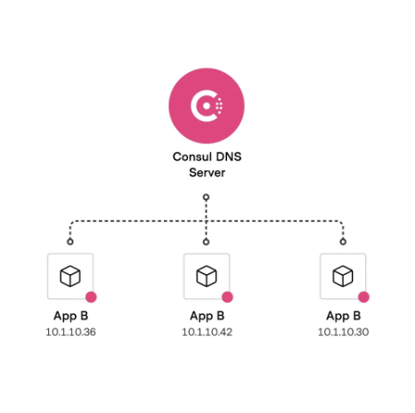

# Comunicação entre sistemas

## Introdução

Este módulo aborda a comunicação entre sistemas, microserviços e arquiteturas distribuídas, destacando sua importância na arquitetura de software. O foco está em entender as diferentes formas de comunicação e escolher a mais adequada para cada contexto, algo crucial para o sucesso de projetos que utilizam microserviços.

A maioria dos desenvolvedores tende a usar apenas uma ou duas formas de comunicação, como REST, o que pode ser um erro dependendo do cenário. É essencial entender que nem todas as comunicações precisam ser síncronas (tempo real). Em muitos casos, uma comunicação assíncrona (onde a resposta não é imediata) é mais apropriada, aumentando a resiliência do sistema ao evitar dependências diretas entre microserviços.

O módulo cobrirá vários protocolos e meios de comunicação, incluindo REST, gRPC, GraphQL e mensageria, como RabbitMQ, Amazon SQS e outros. A comunicação síncrona, que envolve uma resposta imediata após a solicitação, pode tornar os microserviços menos resilientes, especialmente se um serviço estiver indisponível ou lento.

Por outro lado, a comunicação assíncrona, onde as mensagens são enviadas para um sistema intermediário que as entrega conforme possível, permite que os microserviços sejam mais independentes e resilientes. Esses sistemas de mensageria garantem que as mensagens sejam entregues mesmo que os serviços estejam temporariamente fora do ar.

O módulo também abordará preocupações com a consistência dos dados em diferentes microserviços e como lidar com essas questões. A ideia é expandir os horizontes dos desenvolvedores para que possam tomar decisões informadas e adequadas em seus projetos, garantindo a eficiência e resiliência das soluções distribuídas.

### Comunicação sincrona vs assincrona

A discussão aborda as diferenças entre comunicação síncrona e assíncrona, essenciais em arquiteturas de microserviços. Em uma arquitetura de microserviços, cada serviço possui seu próprio banco de dados, o que promove autonomia, mas também pode causar inconsistências temporárias nos dados.

Um exemplo é dado sobre um microserviço de produtos e outro de compras. O serviço de compras sincroniza apenas parte dos dados do produto, como ID e nome, para operar independentemente, mesmo que o serviço de produtos esteja fora do ar. No entanto, se uma atualização ocorrer no serviço de produtos, como uma correção em uma descrição, essa alteração pode não ser imediatamente refletida no serviço de compras, gerando o que se chama de "consistência eventual". Isso significa que os dados podem estar temporariamente inconsistentes entre serviços, mas serão corrigidos em um momento posterior.

Esse cenário ilustra o trade-off entre manter serviços autônomos e lidar com possíveis inconsistências temporárias. A comunicação assíncrona, apesar de causar apreensão inicial entre desenvolvedores, oferece mais flexibilidade e resiliência ao sistema.

## REST

### REST e Níveis de Maturidade

O conceito de REST (Representational State Transfer) é amplamente conhecido entre desenvolvedores, mas muitos não compreendem sua profundidade e os níveis de maturidade que ele envolve. REST, que surgiu em 2000 a partir da tese de doutorado de Roy Fielding, é uma arquitetura que facilita a comunicação entre sistemas de forma simples e padronizada, utilizando HTTP.

Um dos princípios fundamentais do REST é que ele opera de forma stateless (sem estado), o que significa que cada requisição é independente e o servidor não mantém informações sobre sessões. Outro aspecto importante é a capacidade de cachear recursos, melhorando a eficiência.
O Modelo de Maturidade de Richardson é uma estrutura que categoriza o nível de adoção e implementação de REST em uma API.

**Ele possui quatro níveis**:

- **Nível 0**: Refere-se à comunicação básica via HTTP, sem padronização. As operações podem envolver qualquer coisa, como inserções em um banco de dados ou chamadas de procedimentos remotos (RPC).
- **Nível 1**: Introduz o conceito de Resources (recursos), onde as operações são organizadas em torno de substantivos, como "produto". Cada recurso pode ser manipulado por verbos HTTP como GET, POST, PUT e DELETE.
- **Nível 2**: Aumenta a maturidade ao utilizar corretamente os verbos HTTP para as operações apropriadas. GET é usado para recuperação de dados, POST para inserção, PUT para atualização e DELETE para remoção.
- **Nível 3**: Conhecido como HATEOAS (Hypermedia as the Engine of Application State), este nível permite que a API não apenas responda com dados, mas também forneça links para as próximas ações possíveis. Isso torna a API auto-explicativa e orientada ao usuário, como a web, onde páginas e links estão interconectados.

Esse nível de maturidade é raro, mas extremamente valioso, pois melhora a experiência do usuário ao tornar a API mais intuitiva e fácil de usar. A compreensão desses níveis é crucial para desenvolver APIs RESTful que não apenas funcionam, mas também são eficientes e utilizáveis.

### Method e Content Negotiation

Dois conceitos importantes em APIs REST:

- **Method Negotiation**: Envolve a utilização do método `HTTP OPTIONS`, que permite ao cliente saber quais métodos (`GET`, `POST`, `PUT`, `DELETE`, etc.) são permitidos em determinado recurso. Se o cliente tentar usar um método não permitido, receberá um erro `405 Not Allowed`. Isso melhora a clareza para o cliente sobre as operações disponíveis e evita tentativas de uso de métodos inadequados.

- **Content Negotiation**: Refere-se à capacidade do cliente de especificar como deseja receber a resposta do servidor usando o cabeçalho `Accept`. O cliente pode solicitar diferentes formatos, como `JSON`, `XML`, ou `HTML`, e o servidor retornará no formato solicitado, se suportado. Se o servidor não conseguir atender ao formato requisitado, ele retornará um erro `406 Not Acceptable`.
  - **Content-Type Negotiation**: É o processo pelo qual o servidor verifica se pode processar o tipo de mídia que o cliente envia, especificado no cabeçalho `Content-Type`. Se o servidor não suportar o tipo de mídia enviado, ele retornará um erro `415 Unsupported Media Type`.

O objetivo desses conceitos é tornar as APIs REST mais robustas e flexíveis, permitindo uma comunicação mais clara entre cliente e servidor, e garantindo que ambos os lados entendam e processem corretamente as solicitações e respostas.

### Content Negotiation na Pratica

Utilizando uma ferramenta chamada API Tools, podemos ver na prática sobre a criação e o uso de APIs REST com nível de maturidade 3. Pontos principais abordados:

- **Criação de API e Conexão com Banco de Dados**
  - Criar uma nova API chamada "project" e configurar uma conexão com um banco de dados SQLite. A ferramenta API Tools permite trabalhar tanto com APIs REST quanto RPC, além de suporte a versionamento e autenticação.
  - Content Negotiation:
    - Accept Whitelist e Content Type Whitelist:
      - `Accept` especifica o formato de retorno desejado (e.g., JSON, XML).
      - `Content-Type` indica o formato de dados enviados à API.
  Exemplos práticos mostram a API retornando erros apropriados (e.g., `406 Not Acceptable` e `415 Unsupported Media Type`) quando os formatos solicitados ou enviados não são suportados.
- **Maturidade da API**
  - A demonstração explora o conceito de maturidade da API, especialmente a capacidade de fornecer links embutidos (hypermedia) que permitem navegação entre recursos, exemplificando como isso eleva o nível de usabilidade e organização de uma API.
  - Outro destaque a importância de APIs que permitem o versionamento via cabeçalhos, sem precisar alterar a URL base, promovendo uma maior flexibilidade e organização.
- **Validações e Tratamento de Erros**
  - A ferramenta facilita a configuração de campos (e.g., e-mail) com validações adequadas, garantindo que os erros retornados sejam claros e úteis para o desenvolvedor.
  - A documentação e a organização do processo de validação também são mencionadas como aspectos cruciais para APIs robustas.
- **Importância para Desenvolvedores**
  - A atenção aos detalhes, como o tratamento de erros e a correta configuração de content negotiation, diferencia um desenvolvedor no mercado.
  - Uma API bem projetada, com um nível de maturidade elevado, beneficia todos os envolvidos no consumo da API.

Entender a importância de detalhes técnicos ao desenvolver APIs e como o uso de boas práticas e ferramentas adequadas pode melhorar significativamente a experiência de desenvolvimento e consumo dessas APIs é fundamental.

## GraphQL

O GraphQL é uma tecnologia poderosa que, embora não seja amplamente utilizada como deveria, oferece grandes benefícios, especialmente para desenvolvedores front-end. Essencialmente, ele funciona como uma chamada RPC (Remote Procedure Call) entre cliente e servidor, mas com uma vantagem significativa: permite solicitar apenas os campos de dados necessários, proporcionando uma maior granularidade nas informações retornadas.

Essa capacidade do GraphQL evita o envio de dados desnecessários, o que é particularmente útil em cenários onde diferentes dispositivos (como mobile, desktop e TV) requerem conjuntos de dados distintos. Ao invés de utilizar múltiplas APIs ou um único endpoint que retorna todas as informações, o GraphQL possibilita que o back-end forneça exatamente o que é necessário para cada tipo de front-end. Essa abordagem é conhecida como "back-end for front-end" (BFF).

No capítulo, será explorado o funcionamento do GraphQL através de exemplos práticos, incluindo o uso do GraphQL Playground e o desenvolvimento de uma aplicação simples que interage com um banco de dados. O foco será entender como selecionar quais informações serão retornadas, destacando a flexibilidade e eficiência que o GraphQL pode trazer para o desenvolvimento de aplicações.

### Gerando Esqueleto do Servidor GraphQL em Go

- **Criação do Projeto**: Para começar a trabalhar com GraphQL em Go, é necessário configurar o projeto usando o comando go mod init, que inicializa o módulo Go e configura as dependências necessárias.
- **Biblioteca GQLGEN**: Utiliza-se a biblioteca `GQLGEN` para gerar automaticamente a estrutura básica do projeto GraphQL. Essa biblioteca facilita a criação do servidor, gerando uma estrutura pronta para uso com apenas um comando (`go run <pacote>`).
- **Configuração de Dependências**: Um arquivo `tools.go` é criado para gerenciar dependências específicas, que são necessárias para rodar comandos de inicialização do projeto. Este arquivo não faz parte do build final, mas é essencial para a configuração inicial.
- **Execução do Servidor**: Com o esqueleto do servidor criado, o próximo passo é executar o servidor com o comando `go run server.go`. Isso inicia o servidor GraphQL e disponibiliza um playground para realizar consultas e testar o funcionamento da API.
- **Playground GraphQL**: O servidor inclui um playground interativo, onde é possível visualizar a documentação das consultas e testar queries. O exemplo inicial inclui uma query simples para manipular uma lista de tarefas (todo list).
- **Próximos Passos**: A estrutura básica está pronta, e a próxima fase envolve a implementação das funcionalidades da aplicação, incluindo a integração com banco de dados, utilizando Go e GraphQL.

### Criando Schema GraphQL

Trabalhando com GraphQL: Estruturação do Esquema e Mutations

- **Contexto do GraphQL**: GraphQL, assim como REST, gRPC ou CLI, é apenas uma forma de expor sua aplicação. O centro da aplicação deve ser independente da forma de exposição.
- **Estruturação do Esquema**:
  - Criamos dois tipos principais: `Category` e `Course`.
  - Cada `Category` pode ter múltiplos `Courses`, e cada `Course` pertence a uma única Category.
- **Inputs e Queries**:
  - Inputs como `NewCategory` e `NewCourse` são definidos para receber dados de entrada necessários para criar novas categorias e cursos.
  - Criamos um tipo `Query` que permite consultar listas de categorias e cursos.
- **Mutations**:
  - As `Mutations` são **operações de alteração**, como criação de novas categorias e cursos.
  - Foram definidas duas mutations: `CreateCategory` e `CreateCourse`, que utilizam os inputs mencionados e retornam os tipos correspondentes.
- **Próximos Passos**: Implementação das funcionalidades para executar essas mutations e consultas no servidor GraphQL.

### Gerando Esqueleto da Aplicação com GraphQL

Nesta etapa, a aplicação inicial foi configurada para trabalhar com GraphQL, substituindo a estrutura anterior baseada em uma "to-do list". O objetivo foi regenerar o esqueleto da aplicação utilizando o comando `generate`, que cria automaticamente o código necessário com base no esquema GraphQL definido.

**Principais Tópicos**:

- **Resolvers**: São **funções que lidam com as operações** em GraphQL, como consultas (`queries`) e mutações (`mutations`). Por exemplo, `createCategory` é um resolver que será executado para criar uma nova categoria.
- **Esquema e Mutations**: O código gerado inclui métodos para criar e consultar categorias e cursos, que foram definidos anteriormente no esquema GraphQL. Agora, o foco será na implementação desses métodos para permitir interações reais com a aplicação, incluindo o uso de banco de dados.
- **Próximos Passos**: O próximo passo envolve implementar a lógica interna da aplicação, conectando o GraphQL ao banco de dados, o que permitirá que as queries e mutations funcionem corretamente.

Essa etapa é crucial para entender como o GraphQL se conecta com a lógica de negócios da aplicação, separando claramente a camada de exposição (GraphQL) da lógica interna.

### Criando o Resolver para Category em GraphQL

Nesta etapa, o foco foi a implementação de um resolver para a criação de categorias em uma aplicação que utiliza GraphQL.

**Principais Tópicos**:

- **Estrutura da Aplicação**:
  - **Organização do código**: O projeto foi reorganizado, criando uma estrutura de pastas que separa o código relacionado ao GraphQL de outras partes da aplicação. Foi criada uma pasta `internal` para abrigar o código relacionado ao banco de dados.
  - **Criação da Category**: Dentro da pasta `internal/database`, foi criado o arquivo `category.go` que define uma `struct` para representar a entidade `Category` e métodos para interagir com o banco de dados.
- **Implementação do Resolver**:
  - Um método `create` foi implementado na `struct Category` para inserir uma nova categoria no banco de dados, gerando um ID único e armazenando os dados fornecidos (nome e descrição).
  - **Injeção de Dependência**: O resolver foi configurado para utilizar a conexão com o banco de dados através da injeção de dependência, permitindo que o método `create` seja chamado diretamente do resolver GraphQL.
- **Integração com GraphQL**:
  - A `struct` vazia `resolver` foi estendida para incluir o acesso ao banco de dados. Isso permitiu que o resolver do GraphQL, ao receber uma solicitação para criar uma categoria, interagisse com o banco de dados e retornasse os dados no formato esperado pelo esquema GraphQL.

**Próximos Passos**:
O funcionamento completo dessa integração, mostrando como as categorias são criadas e armazenadas no banco de dados através do resolver GraphQL.

### Persistindo Category via GraphQL Playground

Como persistir a entidade Category em um banco de dados utilizando GraphQL através do Playground.

**Passos Importantes**:

- **Configuração Inicial**:
  - Foi utilizado o comando `go mod tidy` para baixar as dependências necessárias, incluindo o pacote para geração de UUID.
  - A conexão com o banco de dados foi configurada utilizando **SQLite**, ideal para testes locais devido à sua simplicidade.
- **Injeção de Dependência**:
  - A `CategoryDB` foi instanciada com a conexão ao banco de dados e injetada no resolver do GraphQL, possibilitando a criação de categorias diretamente pelo GraphQL.
- **Execução no Playground**:
  - A aplicação foi iniciada e o Playground GraphQL foi aberto. Uma mutação `CreateCategory` foi executada para criar uma nova categoria.
  - Durante o processo, um erro foi identificado: a tabela `Categories` ainda não existia. Foi então criada manualmente utilizando comandos SQL no terminal. Após a criação da tabela `Categories`, a mutação foi executada com sucesso, criando a categoria e retornando os valores `id`, `name`, e `description`.

**Próximos Passos**:
A criação de cursos e a implementação de relacionamentos entre as entidades no banco de dados.

### Listando Categorias via GraphQL

Foi abordada a implementação de uma funcionalidade para listar todas as categorias cadastradas em um banco de dados utilizando GraphQL.

**Passos Importantes**:

- **Implementação da Função FindAll**:
  - Criou-se a função `FindAll` para buscar todas as categorias no banco de dados, retornando o `ID` e `Name` de cada uma.
  - A função percorre os resultados da busca, criando e armazenando objetos de categoria em uma lista, que é retornada no final.
- **Integração com o Resolver GraphQL**:
  - A função `FindAll` foi integrada ao resolver do GraphQL. Foi criado um slice de modelos de categorias, que é preenchido em um loop e retornado ao GraphQL.
  - Essa implementação permite ao front-end fazer queries para listar categorias e escolher quais campos (como ID, Name, ou Description) deseja obter.
- **Teste no Playground**:
  - A aplicação foi reiniciada e testada no Playground do GraphQL. A query categories foi executada com sucesso, retornando as categorias cadastradas.
  - A flexibilidade do GraphQL foi destacada, onde o front-end pode solicitar apenas os campos desejados, facilitando a integração.

**Próximos Passos**:
O próximo passo será a implementação da mesma funcionalidade para a entidade de cursos, com alguns detalhes adicionais.

### Implementando Cursos com Go e SQL

Como replicar a implementação anterior de categorias, agora aplicada para a entidade Curso. A estrutura e o processo são semelhantes, com alguns ajustes específicos para a nova entidade.

**Passos Realizados**:

- **Criação da Estrutura do Curso**:
  - Foi criado o arquivo `course.go` no diretório `internal/database`.
  - Definida a estrutura `Course` com os campos `ID`, `Name`, `Description`, e `CategoryID`, relacionando o curso a uma categoria.
- **Construtor para Cursos**:
  - Criada uma função construtora `NewCourse` que recebe a conexão com o banco de dados e a injeta no novo objeto `Course`.
- **Implementação do Método de Criação**:
  - Implementado o método `Create` para inserir um novo curso no banco de dados, similar ao que foi feito para a categoria.
  - Utiliza-se o `UUID` para gerar um ID único para cada curso, e os dados são inseridos na tabela correspondente.
- **Implementação do Método FindAll**:
  - Implementado o método `FindAll`, que busca e retorna todos os cursos cadastrados no banco de dados.
  - A lógica de preenchimento das variáveis e criação dos objetos de curso segue o mesmo padrão utilizado anteriormente com categorias.

**Próximos Passos**:
A implementação dos Resolvers para integrar esses métodos ao GraphQL, permitindo que os cursos sejam manipulados e consultados através das queries e mutations.

### Criando o Resolver de CreateCourse

Neste trecho, foi abordada a criação do resolver para a mutação CreateCourse em uma aplicação GraphQL usando Go.

**Passos Realizados**:

- **Injeção do CourseDB**:
  - Assim como foi feito para categorias, o `CourseDB` foi injetado no resolver para permitir a manipulação de dados de cursos.
- **Implementação do Resolver CreateCourse**:
  - Criado o método createCourse no resolver, que recebe os dados de entrada (`name`, `description`, `categoryID`).
  - Realizada a operação de criação do curso no banco de dados.
  - A mutação retorna o `ID` e o `name` do curso criado.
- **Configuração do Servidor**:
  - Adicionado o `CourseDB` na configuração do servidor, similar ao tratamento feito para categorias.
- **Criação da Tabela Courses**:
  - Foi criada a tabela courses no banco de dados, com os campos `id`, `name`, `description`, e `categoryID`.
- **Teste da Mutação CreateCourse**:
  - Após implementar e configurar tudo, foi testada a mutação CreateCourse, que funcionou corretamente, retornando os dados esperados.

**Próximos Passos**:
A implementação do resolver para a query `GetCourse`, com alguns detalhes adicionais que serão abordados.

### Implementando QueryCourses

A implementação do resolver para a consulta de cursos (`QueryCourses`) em uma aplicação GraphQL usando Go.

**Passos Realizados**:

- **Implementação do Resolver QueryCourses**:
  - Criado o método para buscar todos os cursos armazenados no banco de dados.
  - O resolver usa a função `findAll` para retornar uma lista de cursos. Caso ocorra um erro, ele retorna o erro e um curso vazio.
- **Estrutura do Resolver**:
  - O resolver segue a mesma estrutura utilizada na consulta de categorias. Ele itera sobre os cursos retornados e os mapeia para o modelo GraphQL, realizando um `append` em cada curso encontrado.
- **Teste da Query QueryCourses**:
  - Após a implementação, foi testada a query `queryCourses`, que retornou corretamente os cursos com os campos `ID` e `name`.
- **Discussão sobre Informações Encadeadas (Nested Informations)**:
  - Foi introduzido o conceito de `Nested Informations` em GraphQL, que trata da complexidade de lidar com dados encadeados, como cursos com suas categorias.
  - Ressaltou-se a importância de otimizar essas consultas para evitar múltiplas queries desnecessárias no banco de dados.

**Próximos Passos**: Como trabalhar com essas informações encadeadas em GraphQL, garantindo uma implementação eficiente, aplicável a qualquer linguagem de programação, não apenas Go.

### Dados encadeados

A implementação e o tratamento de dados encadeados (Nested Informations) em uma aplicação GraphQL usando Go. O foco principal foi resolver o problema de relacionamentos entre cursos e categorias, otimizando o código para evitar consultas desnecessárias ao banco de dados.

**Passos Realizados**:

- **Separação dos Modelos**:
  - Criados arquivos separados (`category.go` e `course.go`) para os modelos `Category` e `Course`. Isso permitiu uma organização melhor e uma configuração explícita dos modelos no arquivo `YAML` do projeto.
- **Configuração do GraphQL**:
  - Após a separação, foi ajustado o arquivo YAML para indicar os novos arquivos de modelo. Ao rodar o comando de geração do código, o GraphQL percebeu os novos relacionamentos e gerou resolvers específicos para eles.
- **Implementação do Resolver por Categoria**:
  - Um novo resolver foi criado para lidar com a relação entre cursos e categorias. Esse resolver (`Category Resolver`) permite buscar cursos associados a uma categoria específica.
  - Foi implementado um método `findByCategoryId` que busca todos os cursos relacionados a um `CategoryID` específico.
- **Execução Condicional de Queries**:
  - O sistema foi otimizado para executar a busca de cursos (`findById`) apenas quando solicitado explicitamente na query. Isso evita consultas desnecessárias ao banco de dados, melhorando a performance.

**Resultado Final**: Ao final, a aplicação foi capaz de retornar categorias com seus cursos associados de forma eficiente, executando queries adicionais apenas quando necessário. Isso assegura que a aplicação seja performática, evitando sobrecarregar o banco de dados com consultas redundantes, um dos principais desafios ao trabalhar com GraphQL.

### Encadeamento de Categorias e Implementação de Resolvers em GraphQL

No desenvolvimento de aplicações que utilizam GraphQL, uma das tarefas comuns é o encadeamento de entidades, como cursos e categorias, para otimizar consultas e garantir que os dados retornados sejam completos e relevantes. Este artigo aborda como implementar um resolver que permite buscar a categoria associada a um curso específico em uma aplicação GraphQL.

**Contextualização do Problema**: Ao realizar consultas em GraphQL, é possível buscar dados de forma específica e eficiente. Um exemplo prático é a busca de cursos, onde inicialmente pode-se apenas listar os cursos disponíveis. No entanto, pode surgir a necessidade de obter também a categoria associada a cada curso durante a consulta. Para isso, é necessário ajustar o resolver, criando um mecanismo que associe cursos às suas respectivas categorias.

**Implementando o Resolver**: A primeira etapa para alcançar esse objetivo é entender como os resolvers funcionam em GraphQL. Um resolver é responsável por mapear uma consulta GraphQL para a lógica de recuperação de dados na aplicação. No caso em questão, foi necessário criar um resolver que, ao buscar um curso, também retornasse a categoria correspondente.

O processo envolve a modificação do schema GraphQL para incluir a categoria como parte do retorno da consulta de cursos. A implementação exige a criação de uma função que execute uma consulta SQL, utilizando um `JOIN` entre as tabelas de cursos e categorias, com base no `course_id`. Essa operação permite que a aplicação retorne a categoria correta associada a cada curso.

**Importância do SQL no GraphQL**: Durante o desenvolvimento, é crucial ter um bom entendimento de SQL, especialmente para realizar operações como `JOIN`, que são fundamentais para relacionar dados entre tabelas. Embora `ORMs` (`Object-Relational Mappers`) sejam úteis, dominar SQL garante maior controle e flexibilidade nas consultas, permitindo otimizações que muitas vezes não são possíveis apenas com o uso de ORMs.

**Flexibilidade do GraphQL**: Uma das grandes vantagens do GraphQL é sua flexibilidade. Ao configurar resolvers corretamente, é possível realizar consultas específicas, selecionando apenas os campos necessários para cada situação. Isso otimiza o desempenho e a eficiência da aplicação, além de fornecer uma experiência mais personalizada para os usuários.

**Conclusão**: Entender a estrutura e o funcionamento de resolvers, bem como a integração entre GraphQL e SQL, é essencial para qualquer desenvolvedor que busca construir aplicações robustas e eficientes. Embora detalhes de implementação possam variar, o conceito central de utilizar resolvers para mapear consultas e mutações permanece constante. Ao dominar essas técnicas, você estará preparado para enfrentar desafios similares, independentemente da linguagem de programação ou do contexto da aplicação.

## Iniciando com gRPC: A Revolução na Comunicação Entre Sistemas

No mundo da tecnologia, especialmente na comunicação entre sistemas, surgem constantemente novas soluções que transformam o cenário de desenvolvimento. Uma dessas inovações é o gRPC, uma tecnologia que se destaca por sua eficiência, segurança e versatilidade.

**O Que é gRPC?**: O `gRPC`, desenvolvido pela Google, é uma evolução das antigas chamadas `RPC` (`Remote Procedure Call`), um conceito que já foi amplamente utilizado no passado. Com o avanço das tecnologias, o `gRPC` veio como uma solução moderna para comunicação entre sistemas, permitindo que diferentes serviços se conectem de maneira eficiente e segura.

**Por Que Usar gRPC?**: Enquanto muitos desenvolvedores ainda utilizam REST para comunicação entre sistemas, o gRPC oferece várias vantagens significativas:

- **Eficiência**: O `gRPC` é conhecido por sua **alta performance**, especialmente em cenários que demandam uma comunicação rápida entre serviços. Isso o torna ideal para sistemas que exigem **baixa latência** e **alta taxa de transferência de dados**.
- **Segurança**: A segurança é uma preocupação central no desenvolvimento de sistemas modernos. O `gRPC` oferece um nível de segurança que supera muitas das soluções tradicionais, tornando-o uma escolha robusta para comunicações críticas.
- **Escalabilidade**: Por ser altamente eficiente e seguro, o `gRPC` é amplamente utilizado em grandes corporações como o Google. Muitos dos serviços internos do Google, por exemplo, utilizam gRPC para gerenciar a comunicação entre seus sistemas de forma eficaz.

O gRPC não é apenas uma nova forma de comunicação; é uma evolução significativa que oferece eficiência, segurança e escalabilidade. Com sua adoção crescente, especialmente em ambientes corporativos, entender e dominar o gRPC pode ser um diferencial crucial para desenvolvedores que buscam otimizar suas soluções e estar à frente no mercado de tecnologia.

### Conceitos iniciais

`gRPC` é um framework desenvolvido pela Google com o objetivo de facilitar a comunicação entre sistemas de forma rápida, leve e independente de linguagem. Embora criado pela Google, o projeto agora é mantido pela **Cloud Native Computing Foundation** (`CNCF`), que também cuida de projetos como **Kubernetes** e **OpenTelemetry**.

**Principais Características do gRPC**: O `gRPC` é extremamente leve e performático, sendo ideal para cenários que exigem comunicação rápida e segura, como em arquiteturas de microserviços. Ele é amplamente utilizado para conectar back-ends e aplicativos mobile, apesar de seu uso em navegadores ainda ser limitado.

Uma das grandes vantagens do `gRPC` é sua integração com o protocolo `HTTP/2`, que permite a transmissão de dados em binário e comunicação bidirecional. Essa capacidade de manter uma conexão aberta para múltiplas requisições e respostas aumenta significativamente a eficiência e a velocidade da comunicação entre sistemas.

**Suporte a Linguagens de Programação**: O `gRPC` oferece suporte oficial a várias linguagens, incluindo `Go`, `Java` e `C`. A escolha do C como uma das linguagens principais permite que o gRPC seja facilmente integrado com outras linguagens como `Python`, `Ruby`, `PHP`, `C#`, `Node.js` e `Dart`, aproveitando bibliotecas em C. Essa abordagem evita a necessidade de criar implementações nativas para cada linguagem, facilitando a adoção do gRPC em diferentes ambientes.

O gRPC representa uma evolução significativa na comunicação entre sistemas, oferecendo uma solução moderna e eficiente para desenvolvedores. Sua integração com HTTP/2, suporte a múltiplas linguagens e performance superior fazem dele uma ferramenta essencial para qualquer arquitetura que exija comunicação rápida e segura entre serviços.

### Explorando o gRPC, HTTP/2 e Protocol Buffers

O `gRPC` é uma poderosa ferramenta de comunicação remota desenvolvida pela Google, que se destaca por utilizar o protocolo `HTTP/2` e o `Protocol Buffers` como principais componentes. A arquitetura de `gRPC` baseia-se no conceito de `RPC` (`Remote Procedure Call`), onde um cliente pode invocar procedimentos remotos em um servidor de maneira eficiente e escalável. Essa tecnologia é especialmente útil em sistemas distribuídos e microserviços, onde a comunicação rápida e leve entre diferentes componentes é essencial.

**Protocol Buffers: O Segredo da Eficiência**
Um dos pilares do `gRPC` é o uso do `Protocol Buffers`, uma linguagem de serialização desenvolvida pela Google. Ao contrário de formatos tradicionais como `JSON` ou `XML`, o `Protocol Buffers` serializa dados em um formato binário compacto, o que resulta em arquivos menores e mais rápidos de processar. Essa eficiência se traduz em menor consumo de CPU e largura de banda, aspectos críticos em ambientes de alta performance.

O `Protocol Buffers` exige que os dados sejam estruturados de acordo com um contrato pré-definido, conhecido como `protofile`. Este arquivo de esquema define a estrutura dos dados que serão trafegados entre cliente e servidor, garantindo que ambos os lados entendam o formato dos dados transmitidos. A sintaxe do `protofile` permite a definição clara de mensagens e suas respectivas propriedades, incluindo o tipo e a ordem dos parâmetros, assegurando consistência e rapidez no processamento.

**HTTP/2: A Base Rápida e Confiável**
O `HTTP/2`, utilizado pelo `gRPC`, é uma evolução significativa em relação ao `HTTP/1.1`. Originalmente introduzido com o nome de **SPDY**, o `HTTP/2` foi projetado para ser mais rápido e eficiente, utilizando a mesma conexão TCP para enviar e receber múltiplos fluxos de dados simultaneamente, uma técnica conhecida como multiplexação. Essa abordagem elimina a necessidade de abrir e fechar conexões repetidamente, como ocorre no `HTTP/1.1`, resultando em uma comunicação muito mais rápida.

Além disso, o `HTTP/2` utiliza compressão de cabeçalhos e transmite dados em formato binário, o que não só reduz o tamanho das mensagens, mas também acelera o processo de transmissão e diminui a latência. Esses recursos tornam o `HTTP/2` uma escolha natural para aplicações modernas que exigem alta performance.

**Protocol Buffers vs. JSON: Uma Comparação**
Ao comparar o `Protocol Buffers` com o `JSON`, fica claro que o primeiro oferece várias vantagens em termos de eficiência. Enquanto o `JSON` é legível por humanos e amplamente utilizado, seu formato textual resulta em arquivos maiores e maior consumo de recursos no momento da serialização e desserialização. Em contraste, o `Protocol Buffers`, por ser binário, gera arquivos menores, reduzindo o consumo de rede e acelerando o processamento.

Essa diferença se torna ainda mais evidente em aplicações que exigem alta velocidade e baixo consumo de recursos, onde cada milissegundo conta. A capacidade do `Protocol Buffers` de operar com eficiência em ambientes de grande escala faz dele a escolha ideal para integrar com o `gRPC`.

**Conclusão**
O `gRPC`, apoiado pelo `HTTP/2` e `Protocol Buffers`, representa uma solução moderna e eficiente para comunicação entre sistemas distribuídos. Ao combinar a velocidade e eficiência do `HTTP/2` com a **compactação binária** do `Protocol Buffers`, o `gRPC` oferece uma plataforma robusta e escalável para o desenvolvimento de aplicações de alto desempenho. Para desenvolvedores que buscam otimizar a comunicação entre serviços, o `gRPC` surge como uma ferramenta essencial, alinhando-se perfeitamente às demandas das arquiteturas modernas de software.

### Formatos de Comunicação no gRPC: Explorando Unary, Streaming e Bidirectional Streaming

No universo das arquiteturas modernas, o `gRPC` se destaca como uma poderosa ferramenta para comunicação eficiente entre serviços. Baseado em `HTTP/2` e utilizando `Protocol Buffers (protobuf)`, o `gRPC` permite a criação de APIs altamente performáticas e flexíveis. Um dos aspectos mais interessantes do `gRPC` são os diferentes formatos de comunicação que ele oferece, permitindo que desenvolvedores adaptem as interações conforme suas necessidades específicas.

- **Comunicação Unary**: A forma mais simples de comunicação no `gRPC` é o `Unary`. Neste formato, o cliente faz **uma requisição** ao servidor e aguarda **uma resposta única**. Esse modelo é familiar para a maioria dos desenvolvedores, pois se assemelha às tradicionais chamadas `RESTful`, onde uma solicitação é enviada e uma única resposta é recebida. Embora básico, o `unary` é eficiente para operações simples e diretas.
- **Server Streaming**: O `Server Streaming` adiciona uma nova dimensão ao `gRPC`. Aqui, o cliente envia uma **única requisição**, mas o servidor **responde com um fluxo contínuo de dados**. Este formato é particularmente útil em cenários onde o servidor precisa processar grandes volumes de dados e pode começar a enviar as respostas conforme as processa. Imagine um servidor que precisa realizar cálculos complexos; em vez de esperar até que tudo esteja concluído, ele pode enviar partes da resposta conforme ficam prontas, permitindo ao cliente processar essas informações de forma incremental.
- **Client Streaming**: No `Client Streaming`, a lógica é invertida: o **cliente envia uma série de requisições para o servidor antes de receber uma resposta**. Este formato é ideal quando o cliente precisa enviar grandes quantidades de dados, como um arquivo extenso, que pode ser transmitido em partes para o servidor. O servidor processa essas partes e, ao finalizar o recebimento, envia uma resposta consolidada.
- **Bidirectional Streaming**: Por fim, o `Bidirectional Streaming` combina o melhor dos dois mundos, permitindo que tanto o cliente quanto o servidor enviem fluxos contínuos de dados entre si. Este **modelo é extremamente poderoso** para aplicações que exigem **comunicação em tempo real**, como chats, jogos multiplayer ou sistemas financeiros, onde ambos os lados precisam trocar informações de forma contínua e sem bloqueios.

Ao explorar os formatos de comunicação oferecidos pelo gRPC, fica evidente o salto tecnológico em relação às tradicionais chamadas REST. A capacidade de realizar streaming de dados, tanto do lado do servidor quanto do cliente, abre um leque de possibilidades para construir sistemas mais responsivos e escaláveis.

### Comparativo entre gRPC e REST: Entendendo as Diferenças e Benefícios

Com o avanço das tecnologias de comunicação entre serviços, surge a necessidade de escolher entre diferentes paradigmas que melhor atendam às necessidades de um sistema. Dois dos principais métodos utilizados atualmente são `REST` e `gRPC`. Vamos explorar as diferenças fundamentais entre esses dois métodos, destacando suas características, vantagens e desvantagens.

**REST: Flexibilidade e Simplicidade**
O `REST` (`Representational State Transfer`) é amplamente utilizado na comunicação entre sistemas, especialmente na web. Ele baseia-se na utilização de `JSON` para a troca de dados, o que torna as informações fáceis de ler e manipular. No entanto, essa simplicidade traz algumas limitações:

- **Unidirecional e Sincrono**: `REST` segue um padrão unidirecional, onde o cliente envia uma requisição e aguarda a resposta do servidor. Essa abordagem resulta em maior latência, pois o servidor precisa processar toda a requisição antes de enviar a resposta, sem a possibilidade de streaming de dados.
- **Contrato Flexível**: Embora essa flexibilidade permita diversas implementações, ela também pode ser uma fonte de erros, já que não há um contrato rígido para a troca de dados. Isso pode levar a inconsistências, como a transmissão de um número no formato de string, causando problemas para quem consome a API.
- **Design Pré-definido**: `REST` segue um design predefinido, com métodos como `POST`, `GET`, `PUT` e `DELETE`, e a organização de recursos via `URLs`. Embora isso seja útil para operações `CRUD` (`Create`, `Read`, `Update`, `Delete`), limita a criação de operações mais complexas ou personalizadas.
- **Sem Suporte a Streaming**: Após a troca de informações, a conexão é encerrada, o que significa que `REST` não suporta a transmissão contínua de dados entre cliente e servidor.

**gRPC: Eficiência e Robustez**
Por outro lado, o `gRPC` (`Google Remote Procedure Call`) é uma tecnologia mais recente que traz várias melhorias sobre `REST`, especialmente em termos de desempenho e flexibilidade.

- **Protobuf e Eficiência**: Ao invés de `JSON`, `gRPC` utiliza `Protocol Buffers (Protobuf)`, um formato binário que é mais compacto e eficiente, resultando em menor latência e maior velocidade na transmissão de dados.
- **Bidirecional e Assíncrono**: `gRPC` suporta comunicação bidirecional e assíncrona, o que significa que o cliente e o servidor podem enviar e receber dados simultaneamente e em tempo real, sem bloquear um ao outro. Isso é crucial para aplicações que exigem alta performance e baixo tempo de resposta.
- **Contrato Pré-definido**: `gRPC` utiliza arquivos `protofiles` para definir o contrato entre cliente e servidor, garantindo que ambos sigam o mesmo esquema de dados, reduzindo a chance de erros e inconsistências.
- **Suporte a Streaming**: Um dos maiores diferenciais do `gRPC` é o suporte a streaming. Ele permite que dados sejam enviados continuamente entre cliente e servidor, facilitando a implementação de funcionalidades complexas como atualizações em tempo real.
- **Design Livre**: Ao contrário de `REST`, o design no `gRPC` não é predefinido, permitindo a criação de funções altamente personalizadas que não precisam seguir padrões rígidos. Isso oferece maior flexibilidade na criação de operações complexas e adaptadas às necessidades específicas de um sistema.

Enquanto `REST` oferece uma abordagem simples e amplamente suportada para comunicação entre sistemas, o `gRPC` se destaca em cenários que exigem **alta performance**, **comunicação em tempo real** e **maior controle** sobre o **contrato de dados**. A escolha entre `REST` e `gRPC` **dependerá das necessidades específicas do projeto**, mas fica claro que o gRPC traz benefícios significativos para arquiteturas mais modernas e exigentes.

### gRPC e Protocol Buffers: Uma Introdução e Relação Essencial

Quando se fala em `gRPC` e `Protocol Buffers`, muitas vezes surge a dúvida sobre como esses dois componentes se interrelacionam e quais são suas funcionalidades específicas. Embora estejam frequentemente associados, é crucial entender que, embora `gRPC` dependa dos `Protocol Buffers`, este último pode ser utilizado de forma independente. Vamos explorar esses conceitos para esclarecer como cada um contribui para a construção de sistemas de alta performance.

**gRPC: Um Framework RPC de Alta Performance**: `gRPC` é um framework de código aberto, criado pelo Google, projetado para facilitar a comunicação remota entre sistemas (`RPC - Remote Procedure Call`). Ele é conhecido por sua alta performance e por ser extensível, suportando diversas linguagens de programação. Apesar de ser frequentemente associado ao Google, o "G" no nome `gRPC` não se refere oficialmente à empresa, sendo um ponto de curiosidade e discussão entre os desenvolvedores.

Um dos principais atrativos do `gRPC` é sua capacidade de gerar código para múltiplas linguagens a partir de definições de serviço em `Protocol Buffers`. Isso proporciona um ambiente de desenvolvimento mais eficiente e com menos margem para erros, já que a geração de código automatiza muitas das tarefas que seriam feitas manualmente em outros sistemas.

**Protocol Buffers: Serialização Eficiente de Dados**: Os `Protocol Buffers` (ou `Protobuf`) são um mecanismo de serialização de dados desenvolvido pelo Google, conhecido por ser neutro em relação à linguagem e à plataforma. Eles oferecem uma maneira eficiente de serializar e desserializar dados estruturados, sendo amplamente utilizados em conjunto com `gRPC`.

Apesar de sua popularidade com `gRPC`, os Protocol Buffers podem ser utilizados de forma independente em diversos contextos. Eles permitem que você defina estruturas de dados (mensagens) em um formato altamente otimizado, que pode ser convertido para um formato binário compacto, ideal para transmissões de dados em redes onde a eficiência e a velocidade são cruciais.

Por exemplo, você pode definir uma mensagem chamada `Person` com campos como `id`, `name` e `email` e em seguida, utilizar o `Protobuf` para gerar um arquivo binário compacto que representa essa mensagem. Esse arquivo pode ser transmitido, armazenado ou processado, e depois convertido de volta para sua forma original através da desserialização.

**A Relação entre gRPC e Protocol Buffers**: Quando usados juntos, `gRPC` e `Protocol Buffers` criam uma combinação poderosa para a construção de sistemas distribuídos e serviços de alta performance. O `gRPC` utiliza os `Protocol Buffers` para definir os contratos de serviço (`protofiles`) e para a serialização eficiente dos dados transmitidos entre cliente e servidor. Com a versão 3 dos `Protocol Buffers`, que é a mais recente e mais comum no uso com `gRPC`, as operações são otimizadas para garantir que a comunicação seja rápida e confiável.

É importante notar que, embora o `gRPC` facilite muito a implementação de serviços `RPC`, os `Protocol Buffers` oferecem flexibilidade e eficiência na serialização de dados, mesmo fora do contexto do `gRPC`. Eles podem ser utilizados em qualquer aplicação onde a compactação e a velocidade de transmissão sejam prioridades.

**Leitura e Prática**: Para aqueles que estão começando com `gRPC` e `Protocol Buffers`, é altamente recomendado explorar as documentações oficiais de ambos. O site do `gRPC` (`grpc.io`) fornece guias detalhados para diversas linguagens de programação, enquanto o site dos `Protocol Buffers` oferece uma visão abrangente sobre como definir e trabalhar com mensagens e serviços utilizando essa tecnologia.

Além disso, é essencial não apenas ler a documentação, mas também experimentar na prática. A implementação de pequenos projetos utilizando `gRPC` e `Protocol Buffers` ajudará a consolidar o conhecimento e a entender como essas ferramentas podem ser aplicadas em diferentes contextos de desenvolvimento.

### Como Configurar o Ambiente para Trabalhar com gRPC em Go

Para iniciar o desenvolvimento com `gRPC` utilizando a linguagem `Go`, é essencial configurar corretamente o ambiente, instalando as ferramentas e plugins necessários. Este artigo fornece um guia passo a passo para preparar o seu ambiente de desenvolvimento, incluindo a instalação do compilador `Protocol Buffers` e dos plugins necessários para a geração de código `gRPC`.

- **Instalação do Compilador Protocol Buffers (protoc)**: O primeiro passo para trabalhar com `gRPC` em `Go` é instalar o `protoc`, o compilador do `Protocol Buffers`. O `protoc` é responsável por converter arquivos `.proto` (onde as mensagens e serviços são definidos) em código que pode ser usado diretamente no seu projeto `Go`.
  - **Instalação no MacOS**: Se você estiver utilizando o MacOS, a instalação do `protoc` pode ser feita facilmente através do `Homebrew`, um gerenciador de pacotes para macOS:
  
  ```bash
  brew install protobuf
  ```

  - **Instalação no Linux (WSL2 ou nativo)**: Para aqueles que estão utilizando Linux, ou o Windows Subsystem for Linux 2 (WSL2), o comando é o seguinte:
  
  ```bash
  sudo apt-get install protobuf-compiler
  ```

**Verificação da Instalação**: Após a instalação, é importante verificar se o `protoc` está instalado corretamente e se a versão é compatível (deve ser maior que 3):

```bash
protoc --version
```

Se o comando acima retornar a versão do `protoc`, você está pronto para seguir adiante.

- **Instalação dos Plugins para Go**: Depois de instalar o `protoc`, você precisará dos plugins específicos para `Go`, que permitem a geração de código tanto para as entidades quanto para a comunicação `gRPC`.
  - **protoc-gen-go**: Gera as entidades `Go` a partir dos arquivos `.proto`.
  - **protoc-gen-go-grpc**: Gera as interfaces de comunicação `gRPC` em `Go`.

Execute os seguintes comandos para instalar os plugins no seu ambiente Go:

```bash
go install google.golang.org/protobuf/cmd/protoc-gen-go@latest
go install google.golang.org/grpc/cmd/protoc-gen-go-grpc@latest
```

Esses comandos irão instalar os geradores de código necessários para que o `protoc` possa gerar tanto as entidades quanto as interfaces de comunicação em `Go`.

- **Configuração do Ambiente**: Com o `protoc` e os plugins instalados, você está pronto para começar a desenvolver com `gRPC` em `Go`. Certifique-se de que o seu ambiente está configurado corretamente, verificando se os comandos `protoc` e os plugins estão disponíveis no seu caminho (`$PATH`).

Com essas etapas concluídas, o próximo passo é inicializar o seu projeto `Go` e começar a trabalhar com `gRPC`, utilizando os arquivos `.proto` que definirão as mensagens e serviços do seu sistema.

Configurar o ambiente corretamente é um passo crucial para garantir que o desenvolvimento com `gRPC` e `Go` seja eficiente e livre de problemas. Com o `protoc` e os plugins específicos instalados, você está preparado para começar a implementar serviços de alta performance com `gRPC`, aproveitando ao máximo as capacidades do `Protocol Buffers` para serialização de dados.

### Configurando o Projeto Go para Trabalhar com gRPC

Agora que já instalamos o compilador `protoc` e os plugins necessários, estamos prontos para configurar o nosso projeto `Go` para trabalhar com `gRPC`. Este artigo guia você através do processo de inicialização do projeto, organização das pastas e preparação para a criação dos arquivos .proto.

**Passo 1: Inicialização do Projeto Go**: O primeiro passo é inicializar um novo projeto `Go`. Para isso, utilizamos o comando `go mod init`, que cria o módulo do projeto e define o caminho do repositório onde o projeto será versionado:

```bash
go mod init github.com/seu-usuario/seu-projeto
```

Esse comando cria o arquivo go.mod, que gerencia as dependências do projeto.

**Passo 2: Organização da Estrutura de Pastas**: Uma boa prática ao estruturar projetos `Go` é criar uma pasta chamada `internal`. Essa pasta é usada para organizar o código que será utilizado internamente no projeto, evitando a exposição desnecessária de detalhes de implementação.

```bash
mkdir internal
```

Dentro dessa pasta `internal`, podemos criar subpastas específicas para diferentes partes do projeto, como `database`, onde ficam os arquivos relacionados à persistência de dados. Se você já tem algum código pronto, como o exemplo de integração com GraphQL para gerenciamento de categorias e cursos, você pode copiar esses arquivos para a nova estrutura:

```bash
cp -r /caminho-antigo/database internal/
```

Essa abordagem permite reutilizar código existente e economizar tempo ao configurar a nova aplicação.

**Passo 3: Gerenciamento de Dependências**: Com a estrutura básica do projeto pronta, o próximo passo é garantir que todas as dependências necessárias sejam instaladas. Isso é feito com o comando `go mod tidy`, que limpa o arquivo `go.mod` e instala qualquer pacote ausente:

```bash
go mod tidy
```

Esse comando baixa e prepara todas as dependências que o projeto necessita, garantindo que o ambiente esteja pronto para o desenvolvimento.

**Passo 4: Preparação para o gRPC**: Com a estrutura e dependências prontas, estamos preparados para começar a trabalhar com `gRPC`. O próximo passo será definir o arquivo `.proto`, que descreverá o esquema de dados e os serviços que o `gRPC` utilizará para gerar o código necessário para comunicação entre serviços.

Esse arquivo `.proto` é essencial, pois define o contrato de comunicação, garantindo que tanto o cliente quanto o servidor compartilhem a mesma estrutura de dados e métodos.

Configurar o ambiente e estruturar o projeto de maneira adequada são etapas fundamentais para garantir o sucesso no desenvolvimento com `gRPC`. Ao seguir este guia, você preparou o projeto `Go` com uma base sólida, pronta para a implementação dos serviços `gRPC` utilizando `Protocol Buffers`.

### Criando e Definindo o Arquivo .proto para gRPC em Go

Quando trabalhamos com `gRPC`, o `Protofile` é uma parte essencial do processo, pois define a estrutura de dados e os serviços que serão utilizados para comunicação entre diferentes sistemas. Neste artigo, vamos explorar como criar e configurar um arquivo `.proto` em um projeto `Go`, seguindo boas práticas e convenções.

**Passo 1: Criando a Pasta e o Arquivo .proto**: Para começar, vamos criar uma nova pasta chamada `proto` na raiz do projeto. Essa pasta abrigará o arquivo `.proto`, que conterá todas as definições necessárias para o `gRPC`.

```bash
mkdir proto
touch proto/courseCategory.proto
```

O arquivo `.proto` criado será chamado `courseCategory.proto`. O nome do arquivo pode variar, mas a estrutura e o conteúdo seguem convenções específicas.

**Passo 2: Definindo a Sintaxe e o Pacote Go**: No arquivo `.proto`, a primeira linha deve definir a sintaxe a ser utilizada. No nosso caso, utilizamos a versão 3 do Protocol Buffers:

```proto
syntax = "proto3";
```

Em seguida, definimos o pacote `Go` que será gerado. O pacote é indicado por uma opção chamada `go_package`, que especifica o local onde o código gerado será armazenado. É comum usar o prefixo `pb` para indicar que se trata de um pacote de `Protocol Buffers`:

```proto
option go_package = "internal/pb";
```

Essa linha garante que o código gerado pelo compilador `protoc` será armazenado na pasta `internal/pb` dentro do projeto.

**Passo 3: Definindo as Mensagens**: No `Protocol Buffers`, as mensagens são usadas para definir a estrutura de dados que será trocada entre o cliente e o servidor. Para o nosso exemplo de categorias, podemos definir uma mensagem `Category` com três campos:

```proto
message Category {
    string id = 1;
    string name = 2;
    string description = 3;
}
```

Cada campo da mensagem tem um nome, um tipo de dado (neste caso, string), e um identificador numérico único, que define a ordem dos campos.

Além da mensagem `Category`, podemos definir uma mensagem de resposta que retorna uma ou mais categorias:

```proto
message CreateCategoryResponse {
    repeated Category categories = 1;
}
```

O campo `repeated` indica que a resposta **pode conter várias** instâncias da mensagem `Category`.

***Passo 4: Criando um Serviço gRPC**: O próximo passo é definir o serviço que permitirá operações `gRPC` baseadas nas mensagens que criamos. Um exemplo básico seria um serviço de criação de categorias:

```proto
service CategoryService {
    rpc CreateCategory (CreateCategoryRequest) returns (CreateCategoryResponse);
}
```

Esse serviço contém um método `CreateCategory`, que recebe uma mensagem `CreateCategoryRequest` e retorna uma `CreateCategoryResponse`.

A mensagem de requisição `CreateCategoryRequest` pode ser definida como:

```proto
message CreateCategoryRequest {
    string name = 1;
    string description = 2;
}
```

Aqui, omitimos o campo `id`, pois ele será gerado automaticamente pelo servidor e retornado na resposta.

Com o arquivo `.proto` configurado, você está pronto para gerar o código `Go` que implementa as interfaces `gRPC`. Essa configuração inicial é essencial para garantir que tanto o cliente quanto o servidor compartilhem uma compreensão comum dos dados e serviços trocados. No próximo passo, o foco será gerar os arquivos Go e integrar esses serviços ao seu projeto.

Seguindo essas práticas, você garante que o desenvolvimento com `gRPC` em `Go` seja organizado, eficiente e alinhado com as melhores convenções da indústria.

### Geração de Código gRPC com protoc: Um Guia Prático para Go

Agora que configuramos o nosso arquivo `.proto` com as definições de mensagens e serviços, o próximo passo crucial no desenvolvimento com `gRPC` em `Go` é a geração de código. Este artigo detalha o processo de geração de código utilizando o compilador protoc e como integrar o resultado ao seu projeto.

**Passo 1: Preparando o Comando protoc**: Com as definições já estabelecidas no arquivo `.proto`, o comando `protoc` será utilizado para gerar o código Go correspondente. Abaixo está o comando utilizado:

```bash
protoc --go_out=. --go-grpc_out=. proto/courseCategory.proto
```

Vamos entender cada parte deste comando:

- `--go_out=.`: Indica o caminho onde o código `Go` gerado a partir do `Protocol Buffers` será salvo. O ponto (.) representa o diretório atual.
- `--go-grpc_out=.`: Similar ao anterior, mas este comando é responsável por gerar o código `Go` específico para as interfaces `gRPC`.
- `proto/courseCategory.proto`: Este é o caminho para o arquivo `.proto` que contém as definições que desejamos compilar.
Após executar esse comando, o `protoc` gera dois arquivos principais dentro da pasta especificada, que no nosso caso, é a pasta `internal/pb`.

**Passo 2: Explorando os Arquivos Gerados**: Depois de executar o comando protoc, dois arquivos importantes são gerados:

- `courseCategory.pb.go`: Este arquivo contém as definições das mensagens e suas respectivas funções auxiliares, como `GetId`, `GetName` e `GetDescription`. Estas funções permitem acessar os dados encapsulados nas mensagens `Protocol Buffers`.
- `courseCategory_grpc.pb.go`: Este arquivo define as interfaces `gRPC`. Ele contém a estrutura necessária para implementar os métodos de serviço definidos no arquivo `.proto`. Por exemplo, a interface `CreateCategory` é gerada aqui, que lida com as requisições e respostas associadas ao serviço de categoria.

Esses arquivos são gerados automaticamente e não devem ser editados manualmente, pois qualquer alteração pode ser sobrescrita na próxima geração.

**Passo 3: Integração com o Projeto Go**: Para garantir que o projeto esteja devidamente configurado, é recomendável rodar o comando `go mod tidy`. Esse comando limpa e organiza as dependências do projeto, assegurando que tudo necessário esteja presente e corretamente configurado.

```bash
go mod tidy
```

**Próximos Passos: Implementando o Serviço gRPC**: Com os arquivos gerados, o próximo passo no desenvolvimento é criar a implementação do serviço `gRPC`. Esse serviço utilizará as interfaces e estruturas geradas para processar as requisições e fornecer respostas adequadas. Além disso, a criação de um servidor `gRPC` permitirá que o serviço seja exposto e acessado por clientes `gRPC`.

A geração de código com `protoc` é uma etapa essencial para transformar as definições abstratas do arquivo `.proto` em código `Go` funcional e utilizável. Seguindo as instruções detalhadas acima, você pode automatizar a criação de interfaces e mensagens, integrando-as ao seu projeto de forma eficiente.

### Implementando o Método CreateCategory no gRPC com Go

Após a geração do código necessário utilizando `protoc`, o próximo passo é implementar o método `CreateCategory` para nosso serviço `gRPC`. Este artigo guiará você pelo processo de criação de um serviço em `Go`, focando na implementação da funcionalidade de criação de categorias.

**Passo 1: Estrutura Inicial do Serviço**: Primeiramente, dentro da pasta interna do projeto (`internal`), foi criada uma **subpasta** chamada `services`. Nela, um novo arquivo `category.go` foi adicionado, onde será definido o serviço de `categoria`. O código começa com a criação de uma struct chamada `CategoryService`:

```go
package services

type CategoryService struct {
    pb.UnimplementedCategoryServiceServer
    categoryDB database.CategoryDB
}
```

Aqui, a `struct CategoryService` implementa a interface gerada automaticamente `UnimplementedCategoryServiceServer`, que serve como uma base, garantindo compatibilidade futura e facilitando a adição de novos métodos ao serviço.

**Passo 2: Implementando o Método CreateCategory**: Para implementar o método `CreateCategory`, a função deve seguir a assinatura exigida pela interface, que recebe um `CreateCategoryRequest` e retorna um `CategoryResponse` juntamente com um possível erro.

```go
func (s *CategoryService) CreateCategory(ctx context.Context, in *pb.CreateCategoryRequest) (*pb.CreateCategoryResponse, error) {
    category, err := s.categoryDB.Create(in.GetName(), in.GetDescription())
    if err != nil {
        return nil, err
    }

    return &pb.CreateCategoryResponse{
        Category: &pb.Category{
            Id:          category.Id,
            Name:        category.Name,
            Description: category.Description,
        },
    }, nil
}
```

Neste código, o método `CreateCategory`:

- Recebe o contexto (`ctx`) e a requisição (`in`).
- Utiliza o banco de dados (`categoryDB`) para criar uma nova categoria com os dados fornecidos na requisição.
- Se a criação for bem-sucedida, um `CategoryResponse` é retornado com os detalhes da categoria criada.
- Em caso de erro, o erro é retornado e tratado apropriadamente.

**Passo 3: Detalhes Importantes e Considerações**: Durante a implementação, alguns pontos chave devem ser considerados:

- **Contexto (`ctx`)**: O uso do contexto permite a manipulação de dados adicionais como `headers` e metadados, caso necessário.
- **Tratamento de Erros**: O erro deve ser verificado logo após a tentativa de criação da categoria. Caso ocorra um erro, ele é prontamente retornado.
- **Estrutura de Resposta**: A resposta enviada ao cliente deve estar no formato correto, como especificado no `.proto`. No exemplo, o `CategoryResponse` encapsula a categoria recém-criada.

**Próximos Passos: Configurando o Servidor gRPC**: Com o serviço implementado, o próximo passo é registrar o `CategoryService` em um servidor `gRPC`, permitindo que ele receba e responda a requisições de clientes `gRPC`. Isso será abordado em nosso próximo artigo, onde configuraremos o servidor e implementaremos métodos adicionais para o serviço.

A implementação do método CreateCategory demonstra como converter as definições de serviços e mensagens Protocol Buffers em funcionalidade concreta no Go. Com a criação desse serviço, você está preparado para avançar na construção de uma aplicação robusta utilizando gRPC, capaz de lidar com operações CRUD e mais. No próximo artigo, abordaremos a configuração completa do servidor gRPC e a integração com o serviço criado.

### Criando um Servidor gRPC com Go: Passo a Passo

Implementar um servidor `gRPC` é uma tarefa essencial para desenvolver serviços escaláveis e de alta performance. Este artigo descreve como criar um servidor `gRPC` em `Go`, utilizando um exemplo prático de configuração e registro de serviços.

**Passo 1: Estruturação do Projeto**: Iniciamos criando uma estrutura adequada para o projeto. Dentro da pasta principal, foi criada uma pasta `cmd`, que contém outra subpasta chamada `grpc_server`. Nesta subpasta, o arquivo `main.go` será criado como ponto de entrada da aplicação.

```bash
cmd/
└── grpc_server/
    └── main.go
```

**Passo 2: Configuração do Banco de Dados**: A função main começa com a abertura de uma conexão com o banco de dados:

```go
func main() {
    db, err := sql.Open("sqlite3", "file:categories.db")
    if err != nil {
        panic(err)
    }
    defer db.Close()
    
    categoryDB := database.NewCategoryDB(db)
}
```

Aqui, utilizamos `SQLite` como banco de dados para simplificar o exemplo. A conexão é aberta e, em caso de erro, o programa é encerrado com um `panic`. O `defer db.Close()` garante que a conexão será fechada ao final da execução.

**Passo 3: Criando o Serviço gRPC**: Com a conexão estabelecida, o próximo passo é criar o serviço que será utilizado pelo servidor gRPC:

```go
categoryService := services.NewCategoryService(categoryDB)
```

O `CategoryService` é instanciado e recebe o banco de dados como dependência.

**Passo 4: Configurando o Servidor gRPC**: Com o serviço pronto, criamos o servidor `gRPC`:

```go
grpcServer := grpc.NewServer()
pb.RegisterCategoryServiceServer(grpcServer, categoryService)
```

O servidor é instanciado com `grpc.NewServer()`. Em seguida, registramos o serviço com o método `pb.RegisterCategoryServiceServer`, vinculando-o ao servidor.

**Passo 5: Abrindo uma Conexão TCP**: Para que o servidor `gRPC` possa receber requisições, precisamos abrir uma porta TCP. Isso é feito utilizando o pacote `net`:

```go
listener, err := net.Listen("tcp", ":50051")
if err != nil {
    panic(err)
}
```

Aqui, abrimos a porta `50051`, que é a **porta padrão para servidores `gRPC`**.

**Passo 6: Inicializando o Servidor**: Por fim, inicializamos o servidor `gRPC` para começar a ouvir requisições:

```go
if err := grpcServer.Serve(listener); err != nil {
    panic(err)
}
```

Se o servidor não conseguir inicializar por algum motivo, um `erro` será lançado.

**Passo 7: Adicionando Reflexão para Debugging**: Para facilitar a interação com o servidor, especialmente durante o desenvolvimento, podemos ativar a reflexão:

```go
reflection.Register(grpcServer)
```

A reflexão permite que ferramentas como `Evans`, um `client gRPC`, possam ler e processar as informações do servidor dinamicamente, o que é extremamente útil para debugging e testes.

Com os passos acima, você terá um servidor `gRPC` básico configurado e pronto para uso. A configuração do banco de dados, registro do serviço, abertura de uma conexão TCP e inicialização do servidor são todas partes fundamentais na criação de serviços robustos em Go. No próximo artigo, exploraremos como interagir com este servidor utilizando clientes gRPC, aproveitando a reflexão para facilitar o desenvolvimento e a depuração.

### Interagindo com gRPC Usando Evans: Guia Prático

Após configurar e rodar um servidor `gRPC`, a próxima etapa é interagir com ele para testar e validar as funcionalidades implementadas. Neste artigo, abordaremos o uso de Evans, uma ferramenta de linha de comando desenvolvida em `Go`, que facilita essa interação com servidores `gRPC`. Vamos explorar como instalar, configurar e utilizar Evans para realizar chamadas gRPC de maneira eficiente.

**O Que é o Evans?**: Evans é um **cliente `gRPC` interativo**, que opera em modo `REPL` (`Read-Eval-Print Loop`), permitindo ao desenvolvedor explorar e testar serviços `gRPC` de forma simples e direta. Ele oferece uma interface de linha de comando amigável, onde é possível realizar chamadas aos métodos dos serviços `gRPC` e visualizar as respostas.

**Instalando o Evans**: Existem várias maneiras de instalar o Evans, dependendo do sistema operacional e das preferências do usuário:

- macOS/Homebrew:

  ```bash
  brew tap ktr0731/evans
  brew install evans
  ```

- Docker:
  
  ```bash
  docker run -it --rm ktr0731/evans
  ```

- Go Install:

Para instalar diretamente do código fonte (não recomendado para produção):

```bash
go install github.com/ktr0731/evans@latest
```

É importante garantir que você está usando uma versão do Go superior à 1.16.

**Utilizando o Evans**: Com o servidor `gRPC` rodando e o `Evans` instalado, podemos começar a interagir com o servidor. A seguir, vamos exemplificar o processo.

- **Inicialize o Servidor gRPC**: Certifique-se de que o servidor gRPC está rodando na porta padrão 50051:

  ```bash
  go run cmd/grpc_server/main.go
  ```

- **Abra o Evans em Modo REPL**: Para iniciar o Evans em modo interativo:

  ```bash
  evans -r repl
  ```

  Ao rodar o comando acima, o `Evans` se conecta ao servidor `gRPC` e identifica os serviços disponíveis. Se houver apenas um serviço, ele será selecionado automaticamente.

- **Realizando uma Chamada gRPC**: No console do `Evans`, você pode chamar métodos do serviço. Por exemplo, para criar uma nova categoria:

  ```bash
  call createCategory
  ```

  O Evans solicitará os parâmetros necessários com base no protofile. Você pode, por exemplo, informar o nome e a descrição de uma nova categoria.

- **Gerenciando Respostas**: Se a chamada for bem-sucedida, a resposta será exibida no console. Inicialmente, pode haver um erro, como uma ausência de tabela no banco de dados. Neste caso, o banco de dados deve ser preparado:

  ```sql
  CREATE TABLE categories (id STRING, name STRING, description STRING);
  ```

  Após corrigir o problema, a chamada `gRPC` pode ser repetida, e a resposta retornará as informações da nova categoria criada.

**Ajustando a Estrutura de Resposta**: Em um dos exemplos, a resposta do servidor foi estruturada em dois níveis (category dentro de categoryResponse). Para simplificar, é possível ajustar o protofile e a implementação para retornar apenas o objeto category diretamente, eliminando o categoryResponse.

Essa mudança requer a regeneração dos arquivos `gRPC` e o ajuste no código `Go` que manipula a resposta.

```go
// Exemplo de ajuste na resposta
func (s *CategoryService) CreateCategory(ctx context.Context, req *pb.CreateCategoryRequest) (*pb.Category, error) {
    category := &pb.Category{
        Id:          uuid.New().String(),
        Name:        req.Name,
        Description: req.Description,
    }
    return category, nil
}
```

Após a mudança, reinicie o servidor e utilize o Evans para verificar que a resposta agora é direta, sem níveis adicionais.

`Evans` é uma ferramenta poderosa para desenvolvedores que trabalham com `gRPC`, permitindo uma interação fácil e ágil com os servidores. Com ele, é possível testar e debugar serviços `gRPC` de forma interativa, facilitando a detecção de problemas e a validação de funcionalidades. Nos próximos passos, continuaremos explorando outras funcionalidades do `Evans` e como utilizá-lo para gerenciar e testar diferentes serviços e métodos `gRPC`.

### Criando um Serviço de Listagem de Categorias Usando gRPC

No desenvolvimento de APIs `gRPC`, é comum a necessidade de criar serviços que permitam listar entidades de forma eficiente. Neste artigo, vamos abordar como implementar um serviço para listar múltiplas categorias, utilizando o protocolo `gRPC`.

**Passo 1: Criação da Estrutura de Mensagens no Protofile**: Inicialmente, já temos o serviço de criação de categorias implementado. Agora, vamos adicionar um novo serviço ao nosso arquivo `.proto`, que será responsável por retornar uma lista de categorias.

Para isso, precisamos definir uma nova mensagem que represente essa lista. No `gRPC`, quando se trata de retornar múltiplos itens, utilizamos o tipo `repeated`. Vamos criar uma mensagem chamada `CategoryList`, que conterá uma coleção de categorias:

```proto
message CategoryList {
    repeated Category categories = 1;
}
```

**Passo 2: Definindo o Serviço de Listagem**: Com a mensagem `CategoryList` definida, podemos criar o serviço de listagem. No `gRPC`, **todo método deve receber e retornar uma mensagem**. Como neste caso não precisamos de um parâmetro de entrada, criamos uma mensagem vazia chamada `Blank`:

```proto
message Blank {}

service CategoryService {
    rpc ListCategories (Blank) returns (CategoryList);
}
```

Neste serviço, o método `ListCategories` não recebe nenhuma informação, mas retorna uma CategoryList.

**Passo 3: Geração do Código e Implementação**: Após a definição no `.proto`, é necessário gerar o código correspondente para a linguagem de programação que estamos utilizando. Este processo é feito utilizando o compilador `protoc`:

```bash
protoc --proto_path=./ --go_out=plugins=grpc:. proto/course_category.proto
```

Com o código gerado, nossa interface agora possui o método `ListCategories`, que recebe uma mensagem `Blank` e retorna uma `CategoryList`. O próximo passo é implementar a lógica desse método no servidor `gRPC`, onde ele irá recuperar as categorias armazenadas e retorná-las.

**Conclusão**: Criar um serviço `gRPC` para listar entidades envolve a definição correta das mensagens e serviços no arquivo `.proto`, seguida pela geração do código e implementação do serviço no servidor. Este processo, apesar de simples, é fundamental para a construção de APIs eficientes e escaláveis com gRPC.

### Implementando a Listagem de Categorias em gRPC

Após a criação do serviço `gRPC` para listagem de categorias, conforme discutido anteriormente, o próximo passo é implementar a funcionalidade que permite recuperar todas as categorias do banco de dados e retorná-las ao cliente. Neste artigo, vamos detalhar como essa implementação é realizada.

**Passo 1: Configurando o Método ListCategories**: Primeiro, criamos um método chamado `ListCategories` que faz parte do nosso serviço `gRPC`. Este método recebe um contexto (`context`) e uma mensagem vazia (`Blank`). Ele precisa retornar uma lista de categorias (`CategoryList`).

**Passo 2: Recuperando Categorias do Banco de Dados**: Dentro do método `ListCategories`, precisamos buscar todas as categorias armazenadas no banco de dados. Para isso, utilizamos uma função findAll do nosso repositório, que retorna todas as categorias disponíveis. Se não forem encontradas categorias, a função deve tratar esse caso e retornar um erro apropriado.

**Passo 3: Construindo a Resposta**: Após recuperar as categorias, o próximo passo é criar a resposta que será enviada ao cliente. Utilizamos um loop para iterar sobre as categorias recuperadas e adicioná-las à lista de resposta (`CategoryList`). Isso é feito através do método `append`, que adiciona cada categoria à lista.

No final, o objeto de resposta, contendo todas as categorias, é retornado ao cliente que fez a solicitação.

**Passo 4: Testando a Implementação**: Com a implementação concluída, é hora de testar o serviço para garantir que está funcionando corretamente. Utilizando uma ferramenta de teste como o `Evans`, podemos invocar o método `ListCategories` e verificar se todas as categorias são retornadas conforme esperado.

**Próximos Passos**: Com a funcionalidade de listagem de categorias implementada, agora podemos avançar para outras funcionalidades, como buscar uma categoria específica com base em um parâmetro. Esta evolução permitirá que o serviço seja mais flexível e atenda a diferentes necessidades dos clientes.

Implementar a listagem de categorias em `gRPC` envolve a recuperação dos dados do banco de dados e a construção de uma resposta apropriada. Este processo, embora simples, é fundamental para garantir que o serviço atenda às expectativas e funcione de maneira eficiente. Com isso, temos um serviço funcional e pronto para ser utilizado em produção.

### Implementando a Busca de Categoria Específica em gRPC

Após implementar a listagem de categorias em nosso serviço `gRPC`, o próximo passo é permitir a busca de uma categoria específica pelo seu ID. Neste artigo, vamos explorar como implementar essa funcionalidade de maneira eficiente.

**Passo 1: Definindo o Serviço de Busca**: Para buscar uma categoria específica, precisamos criar um novo método no nosso serviço `gRPC`. Chamaremos esse método de `GetCategory`. Diferente do método de listagem, `GetCategory` requer que o cliente forneça **um identificador (`ID`)** para que a categoria correta seja retornada. No arquivo `.proto`, a definição do serviço pode ser feita da seguinte maneira:

```proto
message CategoryGetRequest {
    string id = 1;
}

service CategoryService {
    rpc GetCategory (CategoryGetRequest) returns (Category);
}
```

Aqui, `CategoryGetRequest` é uma nova mensagem que contém apenas o `ID` da categoria que desejamos buscar.

**Passo 2: Implementando o Método GetCategory**: Com o serviço definido, o próximo passo é implementar o método `GetCategory` no servidor. Este método receberá o `CategoryGetRequest`, buscará a categoria correspondente no banco de dados e retornará a categoria encontrada ou um erro caso o ID não exista.

A implementação do método segue um fluxo simples:

- Receber a solicitação contendo o ID.
- Buscar a categoria no banco de dados usando o ID fornecido.
- Retornar a categoria como resposta ou lançar um erro caso a categoria não seja encontrada.

```go
func (s *server) GetCategory(ctx context.Context, req *CategoryGetRequest) (*Category, error) {
    category, err := db.FindByID(req.Id)
    if err != nil {
        return nil, status.Errorf(codes.NotFound, "Category not found")
    }
    return category, nil
}
```

**Passo 3: Testando a Implementação**: Após implementar o método, é crucial testá-lo para garantir que está funcionando conforme esperado. Utilizando ferramentas de teste como o `Evans`, podemos fazer uma chamada ao método `GetCategory`, passando um ID válido, e verificar se a categoria correta é retornada.

Exemplo de teste:

- Executar o servidor gRPC.
- Copiar um ID de categoria existente.
- Fazer a chamada ao método GetCategory com o ID copiado.
- Verificar se a categoria correspondente é retornada.

**Conclusão**: Implementar a busca por uma categoria específica em gRPC adiciona uma camada importante de funcionalidade ao serviço, permitindo que os clientes obtenham informações detalhadas de uma categoria através de um simples ID. Essa funcionalidade é essencial em muitas aplicações, onde a recuperação de dados específicos é necessária para operações subsequentes. No próximo passo, exploraremos funcionalidades avançadas, como a utilização de streams em gRPC.

### Implementando Streaming de Dados com gRPC

O `gRPC` é uma ferramenta poderosa para comunicação entre serviços, especialmente quando precisamos enviar e receber grandes volumes de dados de maneira eficiente. Uma das funcionalidades mais interessantes do `gRPC` é o **suporte a streams de dados**, permitindo que um canal de comunicação seja mantido aberto para **transmissão contínua** de informações. Neste artigo, exploraremos como implementar `streaming` de dados para a criação de múltiplas categorias em um serviço `gRPC`.

**Introdução ao Streaming com gRPC**: `Streaming` com `gRPC` permite que dados sejam enviados e recebidos continuamente, em vez de uma única solicitação e resposta. Existem cenários em que essa abordagem é extremamente útil, como quando precisamos enviar uma grande quantidade de dados e queremos processá-los de forma incremental.

**Passo 1: Definindo o Serviço de Streaming**: Para implementar o `streaming`, começamos ajustando o arquivo `.proto` para incluir um novo serviço chamado `CreateCategoryStream`. Este serviço será responsável por receber um `stream` de `CategoryRequest` e retornar um `stream` de `CategoryResponse` após todos os dados terem sido processados.

```proto
service CategoryService {
    rpc CreateCategoryStream (stream CategoryRequest) returns (CategoryResponse);
}
```

A principal diferença aqui é a palavra-chave `stream`, que indica que tanto a solicitação quanto a resposta podem consistir em múltiplas mensagens enviadas ao longo do tempo.

**Passo 2: Implementando o Método CreateCategoryStream**: O próximo passo é implementar o método `createCategoryStream` no servidor `gRPC`. Este método será responsável por:

- Receber múltiplas requisições de criação de categorias.
- Processar cada requisição e armazenar as novas categorias.
- Retornar uma lista de todas as categorias criadas quando o stream de entrada for finalizado.

```go
func (c *CategoryService) CreateCategoryStream(stream pb.CategoryService_CreateCategoryStreamServer) error {
  response := &pb.CreateCategoryStreamResponse{}
  for {
    categoryRequest, err := stream.Recv()
    if err == io.EOF {
      return stream.SendAndClose(response)
    }
    if err != nil {
      return err
    }
    categoryDB, err := c.CategoryDB.Create(categoryRequest.Name, categoryRequest.Description)
    if err != nil {
      return err
    }

    response.Categories = append(response.Categories, &pb.Category{
      Id:          categoryDB.ID,
      Name:        categoryDB.Name,
      Description: categoryDB.Description,
    })
  }
}
```

**Passo 3: Testando o Streaming de Dados**: Para testar a implementação, podemos usar uma ferramenta como `Evans` para simular o envio de múltiplas requisições de criação de categorias via `stream`. Durante o teste, podemos observar como o serviço `gRPC` processa cada requisição à medida que chega, mantendo o canal de comunicação aberto até que todas as categorias sejam criadas e enviadas de volta ao cliente.

Exemplo de fluxo de teste:

- Iniciar o servidor gRPC.
- Conectar-se ao servidor utilizando Evans.
- Enviar múltiplas categorias em um único stream.
- Encerrar o stream e verificar se todas as categorias foram processadas e retornadas corretamente.

**Conclusão**: Streaming de dados com `gRPC` é uma técnica poderosa para lidar com grandes volumes de dados ou quando é necessário manter um canal de comunicação contínuo. Neste artigo, mostramos como implementar e testar um serviço de streaming para a criação de múltiplas categorias, demonstrando a flexibilidade e eficiência que o `gRPC` oferece. No próximo passo, continuaremos a explorar outras funcionalidades avançadas do `gRPC`.

### Trabalhando com Streams Bidirecionais usando gRPC

O `gRPC` é uma poderosa ferramenta para comunicação entre sistemas, especialmente quando se trata de trabalhar com transmissão de dados em tempo real através de streams. No artigo anterior, exploramos como realizar um stream unidirecional, no qual dados são enviados de forma contínua e, ao final, o servidor responde com os resultados agregados. Agora, vamos explorar um nível mais avançado de comunicação: o stream bidirecional.

**O que é um Stream Bidirecional?**: Em um stream bidirecional, tanto o cliente quanto o servidor podem enviar e receber dados simultaneamente. Ou seja, o cliente envia dados em tempo real e, conforme o servidor processa essas informações, ele já retorna as respostas, sem a necessidade de esperar a conclusão do envio de todas as informações para gerar uma resposta final.

Esse modelo é ideal para cenários em que é necessário processar grandes quantidades de dados de forma eficiente, como em sistemas de monitoramento em tempo real, aplicações de IoT, ou na comunicação entre microservices em arquiteturas distribuídas.

**Implementando o Stream Bidirecional**: A implementação do stream bidirecional segue a mesma lógica inicial do stream unidirecional, mas com a adição da capacidade do servidor de responder a cada dado recebido. Abaixo, descreveremos os principais pontos da implementação.

- **Definição do serviço no proto**: Primeiro, definimos o método no arquivo `.proto`, onde especificamos que tanto o envio quanto o recebimento de dados será em `stream`:

```proto
rpc CreateCategoryStreamBidirectional (stream CategoryRequest) returns (stream Category);
```

Aqui, o cliente envia um `stream` de `CategoryRequest` e o servidor responde com um `stream` de `Category`.

- **Implementação no Servidor**: No lado do servidor, criamos um loop que processa cada dado enviado pelo cliente e responde imediatamente com o resultado processado:

```go
func (s *CategoryService) CreateCategoryStreamBidirectional(stream pb.CategoryService_CreateCategoryStreamBidirectionalServer) error {
    for {
        // Recebe os dados do stream
        categoryRequest, err := stream.Recv()
        if err == io.EOF {
            // Encerra o stream quando todos os dados forem processados
            return nil
        }
        if err != nil {
            return err
        }

        // Processa a categoria e prepara a resposta
        categoryResponse := &pb.Category{
            Id: categoryRequest.Id,
            Name: categoryRequest.Name,
            Description: categoryRequest.Description,
        }

        // Envia a resposta de volta via stream
        if err := stream.Send(categoryResponse); err != nil {
            return err
        }
    }
}
```

Neste código, a cada vez que o servidor recebe um dado (`stream.Recv()`), ele processa e imediatamente envia uma resposta (`stream.Send()`), mantendo o canal de comunicação aberto até que todos os dados sejam enviados e processados.

- **Execução do Stream Bidirecional**: Para testar essa implementação, utilizamos a ferramenta Evans para simular o cliente. Durante a execução, o cliente envia uma categoria e o servidor já responde com o resultado processado em tempo real:

```vbnet
> call CreateCategoryStreamBidirectional
name: "cat1b"
description: "Cat 1"
```

Ao pressionar `Enter`, o servidor recebe a categoria, processa, e já retorna o resultado. Esse ciclo continua até que o cliente encerre a transmissão com `Ctrl + D`.

**Benefícios do Stream Bidirecional**: Os principais benefícios de se trabalhar com `streams` bidirecionais no `gRPC` são:

- **Eficiência**: O servidor pode processar e responder em tempo real, sem a necessidade de esperar o envio completo dos dados.
- **Baixa latência**: Com o canal de comunicação aberto, o tempo de resposta é significativamente reduzido, uma vez que o servidor não precisa aguardar novas conexões.
- **Escalabilidade**: Ideal para arquiteturas de microservices, onde múltiplos serviços podem se comunicar de forma rápida e eficiente.

**Conclusão**: O `gRPC`, com seu suporte a `streams` bidirecionais, abre possibilidades incríveis para construção de sistemas altamente performáticos e escaláveis. A capacidade de enviar e receber dados simultaneamente traz uma nova dimensão de interatividade e eficiência para aplicações que exigem processamento em tempo real. Se você busca otimizar a comunicação entre seus serviços, vale a pena considerar o uso dessa tecnologia em seus projetos.

## Service Discovery e Consul

### Entendendo o contexto

Cenário comum em aplicações distribuídas:

- Qual máquina chamar?
- Qual porta utilizar?
- Preciso saber o IP de cada instância?
- Como ter certeza se aquela instância está saudável?
- Como saber se tenho permissão para acessar?

O que é **Service Discovery**

- Descobre as máquinas disponíveis para acesso
- Segmentação de máquinas para garantir segurança
- Resoluções via DNS
- Health check
- Como saber se tenho permissão para acessar

### Visão geral do Consul

[Hashcorp](https://www.consul.io/)

- Service Discovery
- Service Segmentation
- Load Balancer na Borda (Layer 7)
- Key / Value Configuration
- Versão Opensource / Enterprise

### Service registry



### Health check e Multicloud

- Health check ativo
  - Tem um agente em cada servidor
  - Quando o agente detectar que está fora, vai avisar o Consul Server
- Multi-região & Multi-cloud

### Agent, Client e Server

- Agent
  - Processo que fica sendo executado em todos os nós do cluster
  - Client mode
  - Server mode
- Client:
  - Registra os serviços localmente
  - health check
  - encaminha as informações e configurações dos serviços para o Server
- Server:
  - Mantém o estado do cluster
  - Registra os serviços
  - Membership (quem é client e quem é server)
  - Retorno de queries (DNS ou API)
  - Troca de informações entre datacenters
- Dev Mode
  - NUNCA utilize em produção
  - Testes de features, exemplos
  - Roda como servidor
  - Não escala
  - Registra tudo em memória

### Iniciando um Agente Consul: Descobrindo o Service Discovery na Prática

O Consul é uma poderosa ferramenta de *Service Discovery* e *Service Mesh*, amplamente utilizada para permitir que serviços encontrem e se comuniquem entre si de forma automática e eficiente. Embora este guia não seja um curso completo de Consul, ele oferece uma introdução prática para entender os conceitos fundamentais e ver o Consul em ação.

#### Configurando o Consul em Modo Desenvolvimento

Para começar, subimos uma instância do Consul utilizando Docker. É importante destacar que o foco aqui é em demonstrar o funcionamento básico do *Service Discovery*, e não em criar uma implementação pronta para produção. Em um ambiente de produção, o Consul deve ser configurado em um cluster seguro, com criptografia via TLS.

Aqui estão os principais passos para configurar o Consul:

1. **Criando o Ambiente com Docker Compose**:
   Um *Docker Compose* básico foi utilizado para configurar a instância do Consul. O processo envolveu a criação de uma máquina Docker com o Consul e o comando `tail -F /dev/null` para manter o container em execução.

   ```yaml
   version: '3'
   services:
     consul:
       image: consul:1.10
       container_name: consul01
       hostname: consul01
       command: tail -F /dev/null
   ```

2. **Iniciando o Agente Consul**:
   Após subir o container, o agente do Consul foi iniciado no modo de desenvolvimento com o comando:

   ```bash
   consul agent -dev
   ```

   Este modo é útil para testes e desenvolvimento, permitindo que o Consul seja executado sem configurações complexas.

#### Comandos Essenciais para Gerenciamento

O Consul oferece uma série de comandos que permitem a administração e visualização do estado do cluster:

- **Visualizando Membros do Cluster**:
  O comando `consul members` exibe os nós ativos do cluster, seu status, tipo (servidor ou cliente), IP e versão.

  ```bash
  consul members
  ```

  Isso é crucial para monitorar quem está participando do cluster, especialmente em ambientes com várias instâncias.

- **Protocolo de Consenso**:
  O Consul utiliza o protocolo *Raft* para garantir consenso entre os nós servidores. Quando um nó líder cai, uma nova eleição ocorre para definir o próximo líder, mantendo a consistência dos dados replicados entre os servidores.

#### APIs e DNS Integrado

Um dos maiores destaques do Consul é sua API robusta e seu servidor DNS embutido:

1. **Acessando a API do Consul**:
   O Consul expõe uma API RESTful que permite consultas detalhadas sobre o cluster. Por exemplo, para listar os nós registrados, é possível fazer uma chamada HTTP:

   ```bash
   curl localhost:8500/v1/catalog/nodes
   ```

2. **Consultas DNS**:
   O Consul também atua como um servidor DNS, permitindo que serviços façam *lookups* para descobrir endereços de outros serviços registrados no Consul. Utilizando o comando `dig`, podemos consultar os IPs dos serviços registrados:

   ```bash
   dig @localhost -p 8600 consul01.node.consul
   ```

   Essa funcionalidade é amplamente usada em ambientes de microserviços para simplificar a descoberta e comunicação entre serviços.

#### Clusters e Data Centers no Consul

Um conceito importante no Consul é o de *data centers*. Embora não seja obrigatório que os serviços estejam fisicamente separados, o Consul usa a designação de *data centers* para organizar e separar logicamente os clusters. Dentro de um mesmo *data center*, o Consul utiliza o *Gossip Protocol* para sincronizar os dados de forma rápida, especialmente em redes de baixa latência.

#### Próximos Passos: Construindo um Cluster Consul

Agora que o agente do Consul está rodando, o próximo passo seria a construção de um cluster com múltiplos nós. Isso envolve configurar mais instâncias do Consul, configurar comunicação segura entre os nós e implementar práticas recomendadas para ambientes de produção.

#### Conclusão

Neste guia, vimos como iniciar um agente Consul e explorar suas funcionalidades básicas de *Service Discovery*, API e DNS. Embora simples de configurar, o Consul oferece recursos avançados para gerenciar clusters complexos em produção. Nos próximos passos, exploraremos a criação de clusters completos e a integração segura em ambientes distribuídos.

### Criando um Cluster de Servidores com Docker Compose

No cenário atual de infraestrutura em nuvem, a necessidade de criar clusters de servidores para garantir alta disponibilidade e resiliência é cada vez mais comum. Um exemplo prático e acessível de como configurar um cluster é utilizando o Docker e ferramentas como o **Consul**, da HashiCorp. Neste artigo, vamos abordar o processo de criação de um cluster de servidores Consul com três nós, utilizando o **Docker Compose**.

#### Preparando o Ambiente com Docker Compose

O primeiro passo para a criação do cluster é configurar os containers que atuarão como servidores. A flexibilidade do Docker permite replicar ambientes de múltiplos servidores facilmente, sem a necessidade de criar várias máquinas virtuais. Usando o Docker Compose, definimos três instâncias de servidores Consul no arquivo de configuração, que serão iniciadas com o comando `docker-compose up -d`.

O script de configuração atribui os nomes **console-server-01**, **console-server-02** e **console-server-03** para os três nós, garantindo uma identificação clara e gerenciável de cada servidor. Esse processo pode ser replicado em poucos minutos, proporcionando uma maneira simples de gerenciar e escalar o cluster.

#### Iniciando os Servidores

Após a configuração dos containers, o próximo passo é iniciar os agentes do Consul em modo servidor. Para isso, utilizamos o comando `console agent -server`, com o parâmetro `bootstrap-expect=3`, que indica que o Consul deve aguardar três servidores antes de se auto-organizar em um cluster.

Cada servidor precisa ser iniciado com seu respectivo IP, que pode ser obtido com o comando `ifconfig`. Além disso, devemos configurar o diretório de dados, onde o Consul armazenará suas informações, e o diretório de configuração, onde os arquivos `.json` ou `.hcl` (HashiCorp Configuration Language) serão armazenados.

#### Conectando os Nós

Com os servidores Consul em execução, o próximo passo é conectar os nós para que eles se reconheçam e formem o cluster. Isso é feito utilizando o comando `console join`, onde um servidor é instruído a se juntar ao IP de outro servidor no cluster.

Após a execução do comando, verificamos o status da rede de servidores com o comando `console members`. Se tudo estiver configurado corretamente, os três servidores aparecerão como membros do cluster, prontos para atuar em conjunto.

#### Automatizando Configurações

Uma preocupação comum ao gerenciar clusters é a repetição de comandos longos e complexos. Para facilitar esse processo, o Consul permite que as configurações sejam centralizadas em arquivos de configuração. Isso significa que, em vez de executar comandos extensos toda vez que um servidor é iniciado, podemos simplesmente definir as configurações no diretório especificado e iniciar o Consul com um comando único, como `consul -config-dir`.

```sh
#01 conectar na máquina
docker compose exec -it consulserver01 sh

#02 obter o ip do eth0 (inet addr)
ifconfig #172.18.0.2

#03 criar as pastas necessárias
mkdir -p /var/lib/consul
mkdir -p /etc/consul.d

#04 inicializar o agent consul no modo server
consul agent -server -bootstrap-expect=3 -node=consulserver01 -bind=172.18.0.2 -data-dir=/var/lib/consul -config-dir=/etc/consul.d

# -server: indica que o agent é no modo servidor
# -bootstrap-expect=3: Indica que haverão 3 instâncias
# -node=consulserver01: indica o nome do node, se não informado, o hostname será utilizado.
# -bind=IP: indica o endereço IP do node
# -data-dir: indica onde serão armazenados os dados do agent consul
# -config-dir: indica onde está o arquivo de configuração do agent consul

# Para cada node server, repetir os itens 01-04, tomando cuidado para alterar, principalmente, -node e -bind

# incluir os nodes
consul join 172.18.0.4 #consulserver02
consul join 172.18.0.3 #consulserver03
```

### Criando o Primeiro Cliente Consul: Um Guia Prático

Neste artigo, vamos explorar o processo de criação de um cliente Consul e sua configuração em um cluster, passo a passo. O Consul é uma ferramenta poderosa para service discovery e gerenciamento de configuração, amplamente utilizada em arquiteturas distribuídas. Vamos iniciar o nosso primeiro cliente e conectá-lo ao cluster que configuramos anteriormente.

**1. Preparação do Ambiente**: Antes de começarmos a criar o cliente, precisamos organizar nossos diretórios para facilitar a gestão dos arquivos de configuração. Para isso, criamos uma pasta chamada `clients` e, dentro dela, outra chamada `consulclient01`, onde armazenaremos os arquivos de configuração do nosso cliente. Além disso, mapeamos esse diretório para o container Docker do cliente, usando volumes para compartilhar o diretório de configuração dentro do ambiente de execução.

```bash
volumes:
  - ./clients/consulclient01:/etc/consul.d
```

**2. Subindo o Cliente com Docker**: Com o ambiente preparado, o próximo passo é subir o container Docker que executará o nosso cliente Consul. Utilizamos o `docker-compose` para gerenciar esse processo, criando e iniciando o cliente com o comando:

```bash
docker-compose up -d
```

Após executar o comando, verificamos o status do cliente com `docker-compose ps` e, em seguida, acessamos o container do cliente via `docker exec` para interagir diretamente com ele.

```bash
docker exec -it consulclient01 sh
```

**3. Configuração do Cliente Consul**: Dentro do container, configuramos o agente Consul como cliente. A configuração básica do cliente consiste em especificar o IP de bind, o diretório de dados e o diretório de configuração.

```bash
mkdir -p /var/lib/consul
mkdir -p /etc/consul.d
consul agent -bind=<IP_DO_CLIENTE> -data-dir=/var/lib/consul -config-dir=/etc/consul.d
```

**4. Verificação e Conexão ao Cluster**: Após iniciar o cliente, verificamos os membros do cluster Consul com o comando `consul members`. Inicialmente, o cliente aparece isolado, pois ainda não está conectado ao cluster. Para resolver isso, realizamos o *join* com os servidores Consul existentes no cluster.

```bash
consul join <IP_DO_SERVER>
```

Após o *join*, verificamos novamente os membros do cluster e confirmamos que o cliente agora faz parte do grupo de servidores e clientes.

**5. Conclusão e Próximos Passos**: Com o cliente Consul devidamente configurado e conectado ao cluster, concluímos esta primeira etapa. No próximo passo, vamos registrar o primeiro serviço no cliente, permitindo que ele seja descoberto e gerenciado dentro do cluster Consul.

Essa estrutura modular e distribuída do Consul facilita a escalabilidade e a resiliência de sistemas distribuídos. Fique atento ao próximo artigo, onde daremos continuidade à nossa configuração, registrando e utilizando serviços.

### Como Registrar um Serviço no Consul

O **Consul** é uma poderosa ferramenta de service discovery que permite gerenciar serviços de maneira eficiente e escalável. No artigo anterior, subimos o nosso primeiro client, conectando-o ao cluster, mas agora vamos registrar nosso primeiro serviço. Esse processo é essencial para que os servidores consigam reconhecer e interagir com novos serviços no ambiente distribuído. Abaixo, detalhamos o processo.

**Preparação do Ambiente**: Antes de registrar o serviço, precisamos criar o arquivo de configuração. Vamos criar um arquivo JSON, onde as especificações do serviço serão descritas. O arquivo, chamado `services.json`, pode ser nomeado como preferir. A estrutura do JSON é simples e flexível, permitindo adicionar diversas tags para ajudar na categorização e identificação dos serviços.

Exemplo de configuração básica do serviço:

```json
{
  "service": {
    "name": "nginx",
    "id": "nginx",
    "tags": ["web"],
    "port": 80
  }
}
```

Aqui, estamos criando um serviço chamado **nginx**, com uma tag de `web` e definindo que ele está rodando na porta 80.

**Registrando o Serviço**: Para que o serviço seja reconhecido pelo Consul, ele precisa ser registrado. Ao registrar, qualquer consulta DNS feita no cluster poderá localizar o serviço por nome ou pelas tags associadas.

Após criar o arquivo de configuração, execute o seguinte comando para recarregar o Consul e reconhecer o novo serviço:

```bash
consul reload
```

Esse comando faz com que o Consul atualize suas configurações, sincronizando o novo serviço.

**Verificando o Serviço no Cluster**: Agora que o serviço está registrado, podemos verificar se ele foi corretamente integrado ao cluster. A maneira mais prática de fazer isso é através de uma consulta DNS utilizando a ferramenta `dig`:

```bash
dig @localhost -p 8600 nginx.service.consul
```

Se o serviço estiver corretamente registrado, o comando retornará o IP associado ao serviço **nginx**. Esse IP será utilizado para comunicação com outros serviços ou servidores no cluster.

**Filtrando por Tags**: As tags são uma maneira poderosa de organizar e filtrar serviços. Por exemplo, se você quiser consultar um serviço por sua tag, pode utilizar o seguinte formato:

```bash
dig @localhost -p 8600 web.nginx.service.consul
```

Isso permite a separação de serviços com o mesmo nome, mas que rodam em diferentes ambientes, como `production` ou `development`.

**Consultando a API do Consul**: O Consul também oferece uma API robusta para consulta e gerenciamento de serviços. Um exemplo de consulta via API seria listar os serviços registrados:

```bash
curl http://localhost:8500/v1/catalog/services
```

Esse comando retorna uma lista de todos os serviços registrados no cluster.

Para listar os nós em que o serviço **nginx** está rodando, podemos usar:

```bash
curl http://localhost:8500/v1/catalog/nodes?service=nginx
```

**Considerações Finais**: Registrar um serviço no Consul é um processo essencial para a descoberta e monitoramento de serviços em ambientes distribuídos. Além de permitir consultas DNS, ele possibilita o uso de tags e integração com a API para facilitar o gerenciamento.

No próximo artigo, vamos explorar a adição de múltiplos serviços e a sincronia deles dentro do cluster.

### Registrando Serviços com Retry Join: Facilitando o Service Discovery

O processo de registro de serviços em um cluster é essencial para garantir a escalabilidade e a confiabilidade das aplicações. No cenário discutido, o uso de **Service Discovery** com o **Consul** e **Docker** foi explorado para registrar automaticamente novos serviços em um ambiente distribuído, facilitando a comunicação entre múltiplas instâncias de **Nginx**.

**Contexto e Objetivo**: No vídeo anterior, foi realizado o registro do primeiro serviço no Consul. O objetivo atual é registrar uma segunda instância do **Nginx**, simulando a existência de um segundo servidor. O grande benefício é que, com dois ou mais servidores registrados, o Service Discovery permite o acesso dinâmico aos serviços por meio de consultas DNS. Isso elimina a necessidade de saber antecipadamente o IP de cada instância do serviço.

**Registro de Serviços com Identificadores Únicos**: Para diferenciar as instâncias no cluster, o ID de serviço foi alterado, mesmo mantendo o mesmo nome de serviço. O Consul exige que cada serviço tenha um ID único, mas permite que o nome de serviço seja o mesmo para diferentes instâncias. Dessa forma, os serviços são facilmente escaláveis, e os IPs são automaticamente registrados e sincronizados.

**Automatizando o Processo com Retry Join**: Um aspecto crucial para facilitar a escalabilidade é a automação. Subir novos agentes e registrá-los manualmente no cluster pode ser trabalhoso e suscetível a erros. Para contornar isso, o comando **retry join** do Consul foi utilizado. Esse recurso permite que, ao subir um novo agente, ele automaticamente tente se conectar a um ou mais servidores já existentes no cluster. O retry join tenta múltiplas conexões até encontrar um servidor disponível, garantindo que o novo serviço seja registrado sem intervenção manual.

**Vantagens do Retry Join**: A principal vantagem do **retry join** é sua capacidade de facilitar o gerenciamento e a escalabilidade do ambiente. Com ele, ao iniciar um novo agente, não é necessário configurar manualmente sua conexão com o cluster. O agente busca automaticamente os servidores disponíveis, se conectando a qualquer um que esteja online. Isso é especialmente útil em ambientes de produção onde há diversas instâncias de um mesmo serviço.

**Consulta e Sincronização dos Serviços**: Uma vez que o agente está registrado no cluster, o Consul permite consultar todos os serviços registrados via DNS. No exemplo, o comando `dig` foi usado para consultar os serviços **Nginx** diretamente pelo DNS local, retornando as instâncias disponíveis. Isso facilita o balanceamento de carga e a escalabilidade, pois o sistema é capaz de identificar todas as instâncias sem precisar de configurações adicionais.

Outro ponto importante é a sincronização automática entre os clientes e servidores do Consul. As informações de serviços ficam disponíveis tanto para o servidor quanto para os clientes, permitindo que consultas sejam feitas localmente, melhorando a eficiência e reduzindo a latência das operações.

**Metadados e Balanceamento de Carga**: Durante o registro de serviços, é possível anexar metadados, como informações sobre a memória ou CPU dos servidores. Esses metadados podem ser usados para configurar um balanceamento de carga inteligente, onde o sistema direciona requisições para instâncias mais capazes, dependendo da sua capacidade de processamento.

**Considerações Finais**: A utilização de **retry join** e Service Discovery com Consul facilita significativamente o gerenciamento de serviços em ambientes distribuídos. A automação no registro e a capacidade de consultar serviços via DNS proporcionam flexibilidade, escalabilidade e eficiência para aplicações modernas. No próximo artigo, serão explorados outros recursos do Consul, mostrando como ele pode otimizar ainda mais a gestão de infraestrutura distribuída.

Esses conceitos são essenciais para quem deseja construir arquiteturas robustas e escaláveis, principalmente em cenários onde o número de serviços cresce rapidamente e a necessidade de automação é crucial.

### Implementando Health Checks no Consul

Os *Health Checks* são uma funcionalidade fundamental para garantir a confiabilidade e disponibilidade de serviços em ambientes distribuídos. No contexto do Consul, essa funcionalidade permite monitorar a saúde dos serviços registrados e evitar que serviços fora do ar sejam considerados como disponíveis. Neste artigo, vamos entender como configurar e utilizar os *Health Checks* no Consul, com base em um exemplo prático envolvendo o servidor Nginx.

**A Importância dos Health Checks**: Imagine que você tem um serviço registrado no Consul, como o Nginx, e esse serviço está fora do ar por algum motivo. Sem uma verificação da saúde do serviço, o Consul continuaria a reportar que ele está disponível, exibindo seu IP no catálogo de serviços. Isso pode resultar em tentativas de comunicação com um serviço inoperante, o que compromete a eficiência e a resiliência do sistema.

É aqui que os *Health Checks* entram em cena. Eles verificam periodicamente se um serviço está ativo e funcionando corretamente. Caso um serviço apresente problemas, ele será removido automaticamente da lista de serviços disponíveis até que volte ao estado saudável.

**Tipos de Verificação Disponíveis**: O Consul oferece várias formas de verificar a saúde de um serviço:

- **Scripts:** O Consul pode executar scripts para verificar o estado de um serviço. Se o script retornar o código 0, o serviço está saudável; caso contrário, será considerado problemático.
- **HTTP:** O Consul pode realizar uma chamada HTTP para verificar se um serviço responde adequadamente.
- **TCP:** Verifica se um serviço está disponível e aceitando conexões em uma porta específica.
- **TTL (Time To Live):** Um serviço é considerado fora do ar se não houver comunicação com ele em um determinado intervalo de tempo.
- **Docker Check e gRPC:** O Consul também suporta verificações específicas para ambientes Docker e gRPC.

**Exemplo Prático: Verificando a Saúde do Nginx**: Para demonstrar na prática como os *Health Checks* funcionam, utilizaremos o Nginx como serviço a ser monitorado. Vamos adicionar um *Health Check* que verifica a cada 10 segundos se o Nginx está respondendo corretamente na porta 80. A configuração básica do check é a seguinte:

```json
{
  "check": {
    "id": "nginx",
    "name": "HTTP on port 80",
    "http": "http://localhost:80",
    "interval": "10s",
    "timeout": "1s"
  }
}
```

Neste exemplo:

- O Consul faz uma chamada HTTP ao *localhost* na porta 80.
- Se o Nginx demorar mais de 1 segundo para responder, ele será marcado como fora do ar.
- O check é executado a cada 10 segundos.

**Testando o Check**: Para testar, inicialmente subimos dois serviços Nginx e verificamos que ambos aparecem no catálogo do Consul. Em seguida, simulamos a queda de um dos serviços. Assim que o serviço cai, ele é removido da lista, e apenas o Nginx ativo continua aparecendo.

Ao derrubar e reiniciar o Nginx, verificamos que o Consul remove automaticamente o serviço inoperante e o adiciona de volta quando ele volta ao ar. Isso demonstra a robustez da implementação de *Health Checks* no Consul, que garante que apenas serviços saudáveis apareçam no catálogo de serviços.

**Conclusão**: A funcionalidade de *Health Checks* do Consul é essencial para garantir que apenas serviços operacionais estejam disponíveis no ambiente de produção. Com múltiplas formas de verificação, desde scripts até chamadas HTTP e TCP, o Consul oferece uma solução completa para monitorar a saúde de serviços distribuídos. Utilizando esses checks, você pode garantir maior disponibilidade e resiliência no seu sistema, evitando interações com serviços indisponíveis.

Esse processo não só melhora a estabilidade do sistema, mas também otimiza o uso de recursos, garantindo que apenas serviços em pleno funcionamento sejam utilizados.

### Sincronização de Servidores via Arquivo JSON

No contexto de arquiteturas modernas, a necessidade de automatizar a configuração e sincronização de serviços é essencial para garantir escalabilidade e eficiência. Neste artigo, discutimos como configurar servidores de forma eficiente usando arquivos JSON e o Consul, uma ferramenta popular para Service Discovery e gerenciamento de configurações distribuídas.

**Automação da Configuração de Servidores**: No processo de gerenciamento de múltiplos servidores, é comum encontrar cenários em que a configuração manual se torna repetitiva e suscetível a erros. Para simplificar esse processo, uma abordagem interessante é centralizar a configuração em arquivos como JSON. A ideia é que, ao invés de digitar inúmeros comandos para configurar o Consul em cada servidor, todas as definições necessárias estejam em um arquivo que o sistema possa ler automaticamente.

**Estruturação da Configuração**: O primeiro passo é organizar o ambiente. No exemplo apresentado, foi criada uma pasta chamada `servers`, onde cada servidor possui um subdiretório correspondente. Para o servidor `server01`, foi criado um arquivo `server.json`, contendo as configurações essenciais do Consul.

No arquivo JSON, foram definidos parâmetros importantes, como:

- **bind_addr**: Define o endereço IP do servidor.
- **bootstrap_expect**: Especifica quantos servidores são esperados na rede (neste caso, três).
- **data_dir**: Define o diretório onde o Consul armazenará os dados, por exemplo, `/var/lib/consul`.
- **server**: Define se o agente Consul será um servidor ou não.
- **retry_join**: Lista os IPs dos servidores para os quais o Consul tentará se conectar automaticamente.

Com essas configurações, o servidor já sobe preparado para se integrar com os outros serviços, minimizando a necessidade de intervenção manual.

**Integração com Docker**: Para tornar o processo ainda mais eficiente, foi utilizado o **Docker Compose**. Ao subir os containers com o `docker-compose`, os volumes são configurados para que os arquivos JSON de configuração sejam mapeados corretamente para o diretório de configuração do Consul dentro do container. Isso permite que o Consul carregue automaticamente as configurações especificadas no JSON ao iniciar.

No Docker Compose, basta adicionar um volume para cada servidor:

```yaml
volumes:
  - ./servers/server01:/etc/consul.d
```

Ao rodar o comando `docker-compose up -d`, o servidor é iniciado automaticamente com as configurações previamente definidas, e o Consul se conecta aos outros servidores listados no arquivo `server.json`.

**Sincronizando Vários Servidores**: A abordagem descrita pode ser facilmente replicada para outros servidores. Ao duplicar o arquivo `server.json` para os servidores `server02` e `server03`, e ajustar os respectivos IPs e diretórios, é possível subir todos os servidores com um único comando.

Após realizar as modificações necessárias, os containers dos servidores podem ser recriados com o comando `docker-compose up -d`, garantindo que cada um deles se conecte aos demais automaticamente.

**Testando a Sincronização**: Para verificar se a sincronização entre os servidores foi bem-sucedida, é possível rodar o comando `consul members`. Esse comando exibe os servidores que estão conectados e prontos para operar em conjunto. Durante o processo, é possível que um ou outro servidor apresente erros de conexão temporários, que são rapidamente resolvidos à medida que os outros serviços sobem.

**Benefícios da Configuração Centralizada**: Essa abordagem de centralizar a configuração em arquivos JSON e automatizar o processo com Docker Compose traz diversos benefícios, tais como:

- **Redução de erros manuais**: A configuração de serviços distribuídos pode ser complexa e suscetível a erros humanos. Centralizar as definições em arquivos facilita a replicação exata da configuração em diferentes servidores.
- **Escalabilidade**: À medida que a infraestrutura cresce, adicionar novos servidores é uma tarefa simples, bastando duplicar e ajustar o arquivo de configuração.
- **Eficiência**: Com um único comando, é possível subir todos os servidores configurados, eliminando a necessidade de repetir comandos em cada máquina.

**Conclusão**: A sincronização de servidores via arquivos de configuração é uma prática que traz eficiência e organização para a administração de serviços distribuídos. Usando ferramentas como o Consul e Docker Compose, é possível automatizar grande parte do processo, garantindo que novos servidores sejam rapidamente integrados ao cluster com o mínimo de esforço manual. Essa abordagem é fundamental para ambientes que precisam escalar de maneira ágil e confiável.

### Trabalhando com Criptografia no Consul

No contexto de redes distribuídas, a criptografia é uma das principais preocupações para garantir que a comunicação entre os nós seja segura e livre de acessos não autorizados. O **Consul**, uma ferramenta de service discovery e gerenciamento de configuração distribuída, oferece duas formas distintas de criptografia: a criptografia de **membership** e o **TLS mútuo**. Neste artigo, vamos explorar a configuração da criptografia de membership no Consul, uma solução prática para proteger o acesso ao cluster.

**A Importância da Criptografia de Membership**: A criptografia de membership é responsável por proteger a comunicação entre os membros de um cluster Consul. Isso significa que, sem a chave de criptografia correta, nenhum nó pode se juntar ao cluster, prevenindo que agentes mal-intencionados entrem na rede de forma inadvertida.

**Geração de Chaves de Criptografia**: A configuração dessa criptografia no Consul é relativamente simples. O primeiro passo é gerar uma chave de criptografia, que será compartilhada por todos os nós que desejam participar do cluster. Para gerar a chave, o Consul oferece um comando integrado:

```bash
consul keygen
```

Este comando retorna uma chave única, que será usada na configuração de cada nó. Todos os servidores e agentes do cluster devem ter a mesma chave definida.

**Aplicando a Chave de Criptografia**: Após a geração da chave, basta incluir o parâmetro `encrypt` com a chave gerada na configuração de cada servidor. A configuração de um dos servidores no arquivo de configuração pode ficar assim:

```json
{
  "node_name": "server01",
  "encrypt": "chave_gerada"
}
```

Repita essa configuração em todos os servidores, substituindo `"server01"` pelo nome de cada nó e utilizando a mesma chave para todos.

**Testando a Configuração**: Com a configuração aplicada, é possível testar se a criptografia está funcionando corretamente. Após subir os servidores com a configuração, execute o comando `consul members` em um dos nós para verificar quais servidores estão no cluster:

```bash
consul members
```

Se algum nó não estiver configurado com a chave de criptografia, ele será impedido de se juntar ao cluster, retornando um erro similar a:

```bash
failed to join cluster: encryption required
```

Isso confirma que o Consul está protegendo a entrada de nós não autorizados.

**Verificando a Segurança da Comunicação**: Para garantir que a comunicação entre os nós está realmente criptografada, é possível monitorar o tráfego de rede usando o **tcpdump**. Esse comando permite capturar os pacotes trafegados em uma determinada interface de rede. No exemplo abaixo, monitoramos a porta utilizada pelo Consul:

```bash
tcpdump -i eth0 -an port 8301
```

Se os dados estiverem criptografados, mesmo com o `tcpdump`, não será possível ler o conteúdo do tráfego.

**Considerações Finais**: A criptografia de membership no Consul é uma maneira eficaz de proteger a comunicação entre os nós de um cluster, garantindo que apenas agentes autorizados possam se conectar. Embora a criptografia de membership não proteja o conteúdo das comunicações, ela garante que apenas membros legítimos participem do cluster. Para uma proteção mais completa, o **TLS mútuo** deve ser implementado, mas isso será assunto para outro momento.

Essa configuração simples e eficaz é crucial para qualquer ambiente de produção que utiliza o Consul. Implementá-la ajuda a garantir a segurança do seu cluster e a impedir que agentes não autorizados interfiram na comunicação da rede.

**Conclusão**: A configuração de criptografia no Consul é uma prática recomendada para proteger clusters distribuídos. Com apenas alguns passos, é possível garantir que somente agentes autorizados participem do cluster, tornando a comunicação entre os nós segura e eficiente.

### Introdução à Interface do Consul e Considerações para Produção

O Consul é uma ferramenta poderosa para Service Discovery, configuração distribuída e gerenciamento de infraestrutura. Ao longo deste artigo, vamos explorar sua interface de usuário (UI), como configurá-la e algumas práticas recomendadas para o uso em produção.

**Interface de Usuário (UI) do Consul**: A interface de usuário do Consul é uma ferramenta que permite gerenciar o console de forma gráfica através do navegador. Embora todos os conceitos possam ser aplicados via terminal, a UI facilita a visualização dos serviços, nós (nodes) e outros recursos do cluster.

**Como Habilitar a UI**: Para acessar a interface de usuário, é necessário habilitar a UI ao iniciar o agente do Consul. Isso pode ser feito com o parâmetro `-ui` na linha de comando. No entanto, se o Consul estiver rodando em um container Docker, é necessário ajustar as configurações para permitir o acesso externo. O parâmetro `-client="0.0.0.0"` deve ser configurado para que a interface seja acessível a partir de outras máquinas.

Além disso, é necessário expor a porta padrão da UI (8500) para acessar o console via navegador. Uma vez que o agente esteja configurado e rodando, a UI estará acessível em `http://localhost:8500/ui`, proporcionando uma visão detalhada do cluster.

**Recursos da UI**: A interface permite gerenciar:

- **Data Centers**: Visualizar e monitorar múltiplos data centers.
- **Serviços e Nós**: Exibir quais serviços estão rodando e em quais nós estão alocados.
- **Key-Value Store**: Um recurso adicional do Consul que permite armazenar variáveis de configuração de forma centralizada. Por exemplo, variáveis de ambiente podem ser armazenadas e recuperadas por aplicações dinamicamente.

A UI também oferece uma visão sobre o líder do cluster e a possibilidade de observar como o consenso entre os nós é formado quando um nó é removido ou adicionado ao cluster.

**Key-Value Store e Intentions**: Além de Service Discovery, o Consul oferece outros recursos, como o **Key-Value Store**, que permite armazenar pares chave-valor para configurações de aplicativos. Esse recurso é útil para centralizar variáveis de ambiente ou configurações que precisam ser acessadas por diferentes serviços.

Outro recurso importante são as **Intentions**, que fazem parte do Consul como Service Mesh. As Intentions controlam quais serviços podem se comunicar entre si, permitindo um controle mais granular sobre o tráfego interno da sua infraestrutura.

**Segurança e Melhores Práticas em Produção**: Para utilizar o Consul em produção, é essencial seguir algumas práticas de segurança, como:

- **Criptografia**: Utilize chaves de criptografia geradas pelo comando `consul keygen` e habilite o TLS (Transport Layer Security) para a comunicação entre os servidores e clientes do Consul.
- **TLS**: A configuração do TLS garante que toda comunicação dentro do cluster seja segura. O Consul possui uma documentação abrangente explicando como criar certificados e configurar o TLS.
- **Três Servidores**: Recomenda-se rodar pelo menos três servidores Consul em produção para garantir alta disponibilidade e resiliência.
- **Autojoin**: Configure o autojoin para que os nós possam se conectar automaticamente ao cluster durante a inicialização, facilitando a manutenção e escalabilidade.

Além dessas práticas, a configuração do DNS é crucial. Cada cliente deve estar configurado com um servidor de DNS que redirecione as consultas para os serviços registrados no Consul, facilitando o Service Discovery.

**Integrações e SDKs**: O Consul oferece integrações com diversas linguagens de programação, como Java e PHP, por meio de SDKs que facilitam a descoberta de serviços em aplicações distribuídas. No ecossistema Java, o Spring Framework oferece suporte robusto para integração com o Consul.

**Conclusão**: O Consul é uma solução robusta para Service Discovery e configuração distribuída. A interface de usuário facilita o gerenciamento do cluster, mas a linha de comando continua sendo a melhor abordagem para configurações avançadas e produção. Quando utilizado com criptografia e TLS, o Consul oferece uma plataforma segura e eficiente para gerenciar serviços em ambientes distribuídos.

Por fim, o Service Discovery é uma parte fundamental da arquitetura de microserviços, e ferramentas como o Consul e o Kubernetes tornam esse processo automático e transparente, simplificando a comunicação entre serviços em ambientes complexos.

Este artigo fornece uma visão geral sobre a interface e as práticas recomendadas para o uso do Consul em ambientes de produção, reforçando a importância da segurança e da escalabilidade na infraestrutura distribuída.
